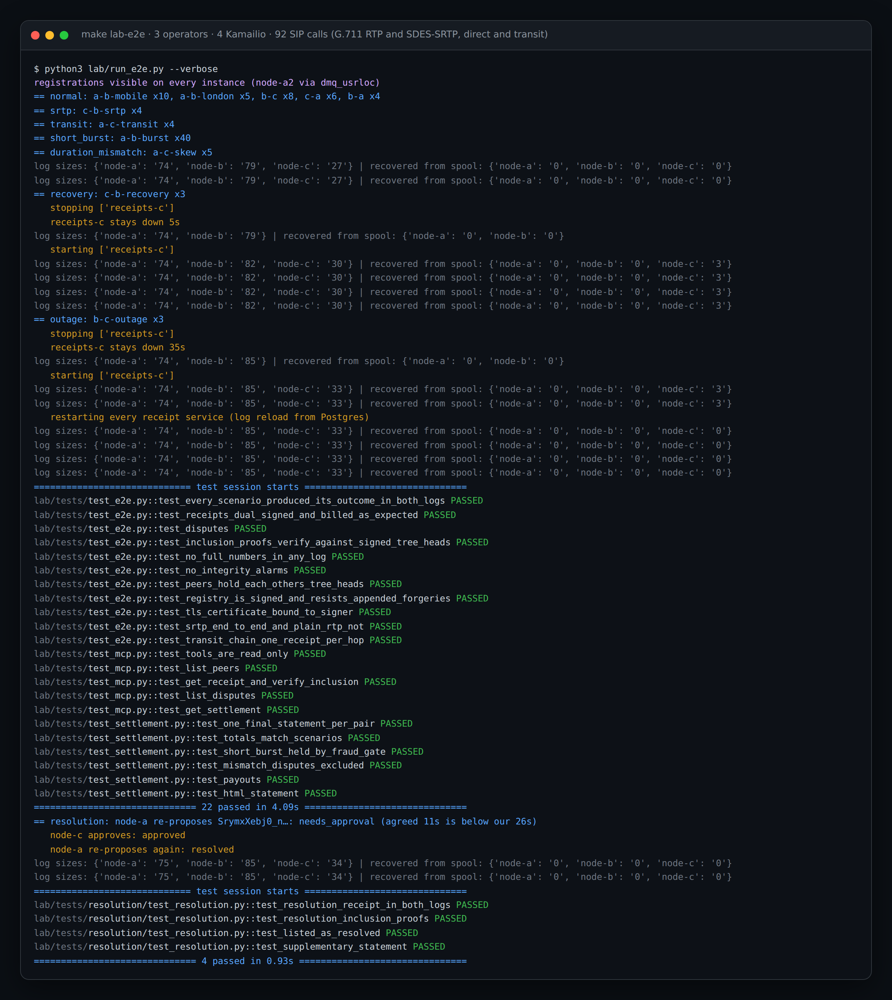
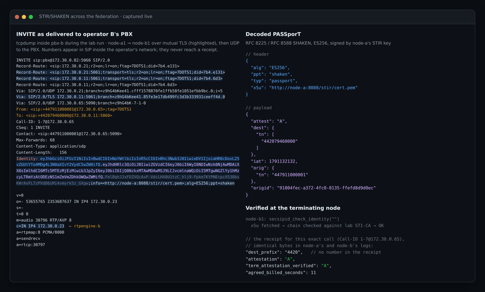
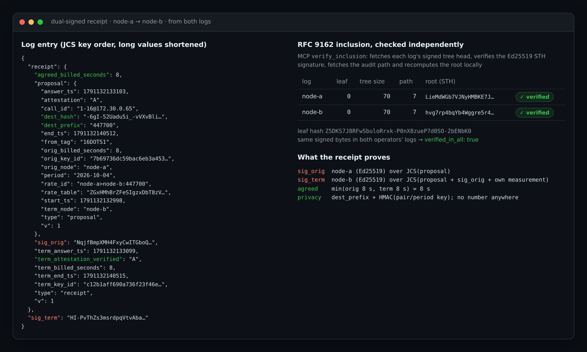
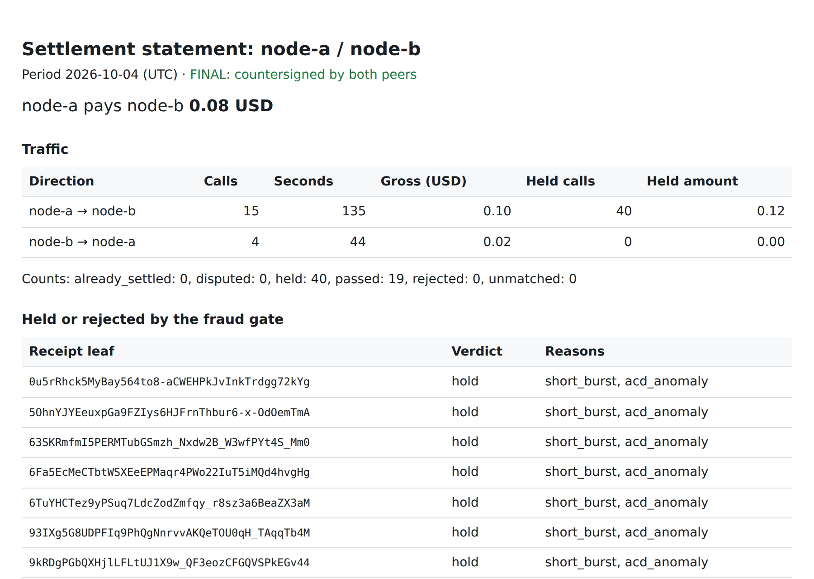
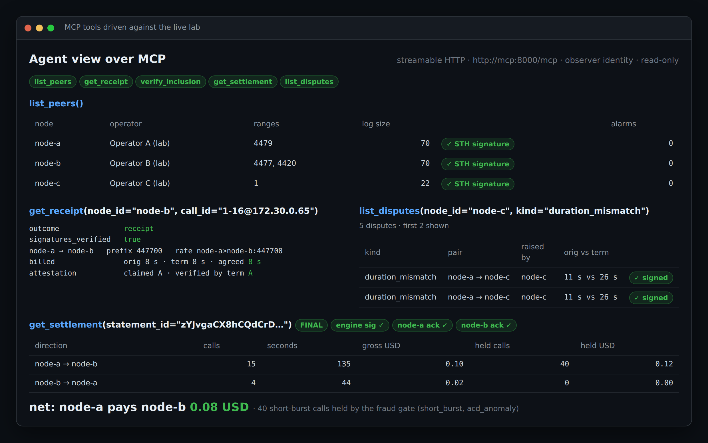
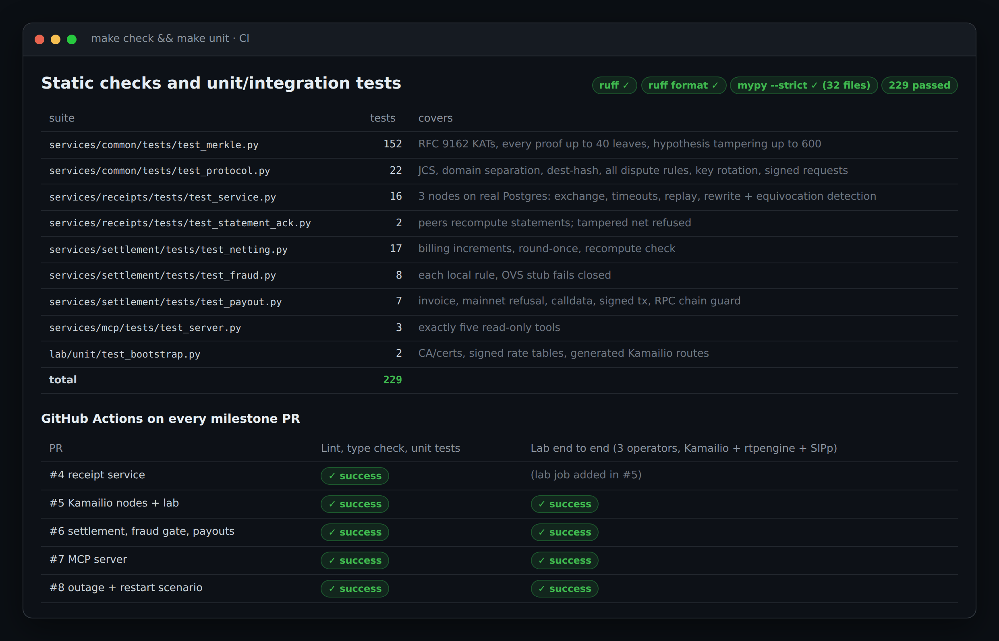

# DOTS 2.0

**Proof of every call, and a bill both sides agree on: open settlement for carriers and AI voice-agent platforms.**

## The problem

When two operators exchange calls (a carrier and a voice-AI platform, or two carriers), each one keeps its own call records and bills from them. The records never quite match, and that causes the same four problems everywhere:

- **Disputes come late and cost a lot.** The two sides find out at month end that their minutes differ, then spend weeks reconciling CSV files. Nobody can prove which record is right.
- **Fraud gets paid before anyone notices.** Traffic pumping, IRSF and false answer supervision exist because whoever sends minutes gets paid for them. By the time a monthly review spots it, the money is gone.
- **Caller identity is lost along the way.** STIR/SHAKEN is checked when the call arrives, but the result rarely reaches the bill. For AI agents that answer the phone, "was this caller real?" matters per call.
- **Settlement depends on a middleman.** A clearing house or one party's billing system is the record everyone has to trust, and it takes a cut.

Voice AI makes all four worse. Agent platforms buy and resell minutes from many carriers, at high volume, often to and from automated callers.

## What DOTS gives you

- **One signed record per call.** The calling and the receiving operator both sign the same receipt in real time: duration, rate, verified caller attestation. There is one agreed record instead of two to reconcile. Disagreements show up in seconds as signed disputes, with a workflow to settle them.
- **Records nobody can quietly change.** Each operator keeps its receipts in a tamper-evident log, built like Certificate Transparency's, and the operators check each other's logs. Any call can be proven present and unaltered without revealing phone numbers.
- **Fraud stopped before payment.** Suspicious traffic (short-call bursts, odd answer rates or call durations, high-risk destinations, calls with no audio, volume spikes) is held, not paid.
- **A daily bill both sides countersign.** The settlement engine nets each pair of operators every day. Each operator recomputes the statement from its own log and countersigns it, and only then is it paid, by fiat invoice or (on testnet) USDC.
- **Built for AI agents.** A read-only MCP server lets an agent or its orchestrator ask "was this call receipted, for how long, is it provably in both logs, what do I owe or earn today".
- **No middleman to trust, and no token.** Settlement is bilateral and every number can be checked by both sides. DOTS runs on Kamailio and rtpengine, the SIP stack operators already use.

## How it works

```
caller ── operator A's node ══ SIP over mutual TLS + STIR/SHAKEN ══ operator B's node ── callee / AI agent
                │                                                         │
                └──────── receipt signed by A, countersigned by B ────────┘
                          appended to both operators' logs
                                       │
                 daily netting → fraud gate → statement countersigned by A and B → payout
```

Each operator runs a **DOTS node**: Kamailio, rtpengine, and a receipt service with its own Postgres. Nodes peer over SIP/TLS. When a call ends:
1. The originating node proposes a receipt.
2. The terminating node checks it against its own record and countersigns it, or raises a signed dispute.
3. Both append the result to their logs.

A shared **settlement engine** turns the receipts into daily statements. The ledger proves *what was exchanged and agreed*. It does not route calls, hold presence, or mint anything.

## Deployment: next to your SBC and softswitch

DOTS does not replace your SBC or softswitch. Receipts travel between operators over HTTPS, beside the call path. What DOTS needs from your network is, per call, a call-end event, the STIR/SHAKEN result, and the PASSporT `origid` as a key that survives B2BUAs. You can provide that in either of two ways:

```
A. DOTS edge (what the lab runs): new peerings, voice-AI platforms
   customers ─ SBC ─ softswitch ─┬─ SBC ─────────────────── classic interconnects
                                 └─ DOTS node (Kamailio + rtpengine) ══TLS══ DOTS peers

B. Sidecar: existing carriers, no change to the call path
   customers ─ SBC ─ softswitch (e.g. Sippy) ─ SBC ══════ peer SBC ─ peer softswitch
                         │ RADIUS accounting                              │
                         ▼                                                ▼
                    dots-radius → receipt service ◀══ HTTPS receipts ══▶ peer receipt service
```

**A. DOTS edge.** Your softswitch keeps routing and rating, and sends the trunk group for DOTS peers to the DOTS node. The node does mutual-TLS peering, STIR/SHAKEN, transit, SRTP end to end, and media anchoring with packet counts for the fraud gate.

**B. Sidecar.** Your softswitch stays exactly where it is and adds the DOTS adapter as one more RADIUS accounting server.
- **What it reads.** The adapter (`dots-radius`) reads Sippy's accounting format: Cisco VSAs `h323-*`, the Cisco-AVPair `call-id`, and the calling and called station IDs.
- **What you add.** Add `dots-origid=<PASSporT origid>` as an extra accounting attribute. That key lets the other operator find the same call even though both sides' B2BUAs rewrote the Call-ID.
- **Reliable delivery.** Records are verified with the RADIUS shared secret. A record is acknowledged only once it is stored, so nothing is lost if the receipt service is briefly down.
- **What you give up.** There are no media packet counts, so no `no_media` rule.

```sh
# Pattern B: one adapter per operator, next to its receipt service
DOTS_NODE_ID=node-a \
DOTS_RECEIPTS_URL=http://receipts-a:8080 DOTS_INTERNAL_TOKEN_FILE=/state/node-a/token \
DOTS_RADIUS_SECRET_FILE=/etc/dots/radius.secret \
DOTS_RADIUS_PEERS="203.0.113.20=node-b,198.51.100.0/24=node-c" \
dots-radius                      # listens on UDP 1813; add it as an accounting server in Sippy
```

The details are in [ARCHITECTURE.md §8.4](docs/ARCHITECTURE.md#84-deployment-where-dots-sits-next-to-an-sbc-and-a-softswitch) and [§5.9](docs/ARCHITECTURE.md#59-correlation-through-b2buas-the-passport-origid). The lab runs both patterns: the Kamailio nodes, plus two simulated Sippy switches sending RADIUS through B2BUAs.

> **Status:** Phase 1 and Phase 2 complete (see [`docs/PLAN.md`](docs/PLAN.md#phase-2)). The only open item is the Open Voice Shield client, which is waiting on the OVS API spec.
>
> The 3-operator lab runs end to end on every PR, on Kamailio 6.0 and 6.1:
> - SIP calls through Kamailio with STIR/SHAKEN, plain or SDES-SRTP end to end, direct or in transit;
> - dual-signed receipts in RFC 9162 logs, and a signed, majority-endorsed peer registry;
> - fraud-gated settlement countersigned by both peers, dispute resolution and supplementary statements;
> - payouts (fiat invoice, testnet USDC) and a read-only MCP server for agents.
>
> Known gaps are listed in [`docs/PLAN.md`](docs/PLAN.md#follow-up-work-known-gaps). See [`docs/ARCHITECTURE.md`](docs/ARCHITECTURE.md) for the design, [`docs/PLAN.md`](docs/PLAN.md) for the build plan and [`docs/QA.md`](docs/QA.md) for test evidence.

<p align="center">
  
</p>

## Use cases

**1. Voice AI agent platforms (the lead use case).** AI voice agents now answer and place phone calls at scale: support lines, appointment booking, outbound qualification, collections. A voice-agent platform buys inbound and outbound minutes from several carriers and resells them to its own customers by the minute. Every party in that chain argues over the same questions:
- Was this call really answered, and for how long?
- Was the caller who they claimed to be?
- Is this traffic real or pumped?
- Does my bill match my carrier's?

DOTS answers these per call, with proof:
- **One record, two signatures.** Each call between the carrier's node and the platform's node gets a receipt signed by both, so there is a single agreed record instead of two CDR files to reconcile.
- **Verified caller identity.** The STIR/SHAKEN attestation the platform's node verified is part of the signed record. An agent can refuse or treat differently a call that arrived unattested.
- **Fraud is caught before it is paid.** Traffic-pumping and bot-to-bot bursts are held by the fraud gate.
- **A daily statement both sides countersign.** It is payable as a fiat invoice or a testnet USDC transfer.
- **The agents can check it themselves.** Over MCP, an agent or its orchestrator can ask "was my last call receipted, for how many seconds, is it provably in both logs, what do I owe or earn today". There is no billing portal and no CSV export.

**2. Carrier-to-carrier settlement** without a clearing house: bilateral, daily, countersigned, with per-call disputes and a resolution workflow instead of month-end reconciliation.

**3. Transit and hubbing:** one receipt per hop (A→B, B→C), linked under signature, each settled in its own pair statement.

**4. Audit and arbitration:** inclusion proofs and signed tree heads show that a call was logged by both parties and never altered, without revealing phone numbers.

**5. Encrypted media without trusting relays:** SDES-SRTP passes every node with the endpoints' keys unchanged, and every node records whether a call was end to end.

### Example: a voice AI agent platform on DOTS

Your platform runs a DOTS node: Kamailio, rtpengine and a receipt service. Your agent stack sits behind it as an ordinary SIP endpoint (LiveKit SIP, Jambonz, Asterisk/FreeSWITCH in front of an LLM voice pipeline, or anything else that speaks SIP). Carriers peer with your node over mutual TLS.

```
caller ── carrier B ── node-b ══ TLS + STIR/SHAKEN ══ node-c (your node) ── your AI agent
                         │                               │
                         └──── dual-signed receipt ──────┘   → daily statement, payout
                                                             → MCP: your agent asks about its calls
```

In the lab, operator C (`node-c`, number range `+1`) plays your platform. [`examples/voice-agent/compose.yml`](examples/voice-agent/compose.yml) switches off C's lab PBX and puts an `agent` service in its place. The stand-in agent registers, answers and plays audio; swap its image for your own SIP endpoint. Your endpoint needs to:
- **Register** as `sip:pbx@node-c` with `node-c1:5060` (UDP), from node-c's access network.
- **Answer inbound calls** with G.711 A-law, or with SDES-SRTP for end-to-end encrypted media.
- **Place outbound calls** with `INVITE sip:+<E.164>@node-c1:5060`. node-c signs the STIR/SHAKEN Identity header for you.

**Quick start:**

```sh
make lab-up                                   # 3 operators: A, B (carriers), C (your platform)
docker compose stop pbx-c                     # C's lab PBX steps aside...
docker compose -f docker-compose.yml -f examples/voice-agent/compose.yml up -d agent   # ...for your agent

examples/voice-agent/call.sh                  # a carrier-B customer calls +14155550142, your agent answers
#   call_id=1-90@172.30.0.81  from_tag=90DOTS1

uv run python examples/voice-agent/ask.py 1-90@172.30.0.81 90DOTS1   # what the agent sees over MCP
```

`ask.py` calls two MCP tools. This is the output from a lab run (trimmed):

```jsonc
// get_receipt(node_id="node-c", orig_node="node-b", call_id=..., from_tag=...)
{ "outcome": "receipt",
  "receipt": { "orig_node": "node-b", "term_node": "node-c",
               "orig_billed_seconds": 9, "term_billed_seconds": 9, "agreed_billed_seconds": 9,
               "dest_prefix": "1", "rate_id": "node-b>node-c:1",
               "attestation_claimed": "A", "attestation_verified_by_term": "A" },
  "signatures_verified": true }
// verify_inclusion(call_key=...)  RFC 9162 proofs against both operators' signed tree heads
{ "verified_in_all": true,
  "results": [ { "log": "node-b", "included": true, "verified": true, "leaf_index": 87, "tree_size": 88 },
               { "log": "node-c", "included": true, "verified": true, "leaf_index": 36, "tree_size": 37 } ] }
```

**Connecting your own agents.** Any MCP client can use the same five read-only tools. With Claude Code:

```sh
claude mcp add --transport http dots http://127.0.0.1:8000/mcp
```

Then ask, for example: *"Using dots, check that call 1-90@172.30.0.81 from node-b was receipted by both operators, prove it is in both logs, and show today's settlement between node-b and node-c."* The agent calls `get_receipt`, `verify_inclusion` and `get_settlement`; each signature it reports is checked locally, not taken on trust. Write tools (payouts, dispute actions) are deliberately not exposed.

**From the lab to production.** You run your own node with your own keys, certificates and STIR certificate:
- **Membership:** the existing members endorse your registry entry, a majority being required (ARCHITECTURE.md §4.1).
- **Prices:** each carrier signs a rate table with you.
- **Payouts:** settlement runs daily, and payout uses your invoice system or the stablecoin adapter (testnet only in this repo).

## What a node is

| Component | Role |
|---|---|
| Kamailio 6.0 / 6.1 | SIP proxy/registrar, mutual-TLS peering, DMQ replication, STIR/SHAKEN Identity sign/verify, transit, durable call-end events |
| rtpengine | Media relay / NAT traversal; SDES-SRTP relayed end to end without decryption, with packet counts kept for the fraud gate |
| Receipt service | Ed25519 node identity bound to the TLS certificate, receipt signing and countersigning, disputes and their resolution, Merkle log, signed tree heads |
| Postgres | Receipt, dispute and log storage |

Shared across the federation (one instance in the lab): the **settlement engine** and a read-only **MCP server** that lets AI agents query peers, receipts, inclusion proofs, settlements and disputes.

## Why not the 2018 design

DOTS started in 2018 as a paper proposing replicated SIP registrars plus a blockchain/ICO paying nodes per minute ([`docs/2018-paper.md`](docs/2018-paper.md)). DOTS 2.0 keeps the federated-operator idea and drops the rest:

- **Per-minute rewards invite fraud.** Traffic pumping, IRSF and false answer supervision are the business model of anyone paid for raw minutes. Nothing is paid without passing a fraud gate.
- **Presence does not belong on a chain.** It changes every second; consensus latency is fatal. Replication is SIP-native (Kamailio DMQ).
- **Consumer privacy is already solved** by E2EE messaging apps. The unsolved problem is trust and settlement *between operators*.
- **E.164 cannot be decentralized**, and PSTN-bridging nodes carry licensing and lawful-intercept duties. DOTS nodes are accountable, identified operators.
- **No token, no ICO.** Settlement is in fiat or an existing stablecoin.

## Repository layout

```
node/kamailio/        Kamailio 6.x routing script, entrypoint, image
node/rtpengine/       rtpengine image
services/common/      Shared primitives: JCS, Ed25519, RFC 9162 Merkle, protocol, netting
services/receipts/    Receipt service (FastAPI, Postgres)
services/settlement/  Settlement engine, fraud gate, payout adapters
services/mcp/         Read-only MCP server
lab/                  Topology, bootstrap, SIPp scenarios, end-to-end tests
docker-compose.yml    The lab
examples/voice-agent/ A voice-AI platform as a DOTS operator (compose override, call + MCP scripts)
docs/                 Architecture, plan, 2018 paper
```

## What the lab demonstrates

| | |
|---|---|
| Federation | 3 operators, 4 Kamailio instances, SIP over mutual TLS, peer identity from certificate CN |
| STIR/SHAKEN | Identity signed by the originating node and verified by the terminating node (x5u fetch, lab STI-CA) |
| Replication | `dmq_usrloc` inside operator A's two-instance cluster; every inbound call to A depends on it |
| Receipts | 92 real G.711 calls (4 of them SRTP, 4 in transit): 88 dual-signed receipts and 8 disputes, each byte-identical in both parties' logs; no full numbers in any receipt or log |
| Integrity | Inclusion and consistency proofs, peer monitoring, equivocation detection through STH gossip |
| SRTP | SDES-SRTP calls cross both nodes end to end: rtpengine forwards the endpoints' keys unchanged and relays without decrypting, while still counting packets. Both nodes report `e2e`; plain RTP calls never do |
| Transit | node-a reaches node-c's numbers through node-b: one dual-signed receipt per hop (A→B, B→C), the onward one linked to the upstream leg under node-b's signature, and node-c verifies node-a's attestation |
| Disputes | Injected 15 s duration skew becomes `duration_mismatch` disputes, excluded from settlement. One is then resolved by the operators (re-proposal, approval of the concession): the resolution receipt lands in both logs and a supplementary statement pays exactly that call |
| Sidecar (pattern B) | Two simulated Sippy switches send RADIUS accounting for one call through B2BUAs (different Call-IDs, same PASSporT `origid`); both operators' receipt services agree on one dual-signed receipt |
| Resilience | Kamailio spools every call-end event durably: a receipt service down for a short while recovers its calls and they settle normally; a longer outage still yields signed `missing_countersignature` disputes; all receipt services restart with their logs intact |
| Fraud gate | A 40-call short-duration burst is held (`short_burst`, `acd_anomaly`); per-route baselines for ACD, ASR and volume |
| Registry | Members are admitted by a majority of existing members; forged entries appended to the live registry change nothing; each node's TLS certificate is bound to its signing key |
| Settlement | Per-pair daily statements, recomputed and countersigned by both peers; totals match values computed independently from the scenario file |
| Payouts | Invoice records and signed (not broadcast) Base Sepolia USDC transfers |
| Agents | MCP tools `list_peers`, `get_receipt`, `verify_inclusion`, `get_settlement`, `list_disputes` |

Upstream projects (Kamailio, rtpengine, SIPp, Postgres) are consumed as packages or container images, never vendored.

## Evidence from the lab

Captured during an end-to-end run. Raw logs and data are in [`docs/qa/`](docs/qa/); the walkthrough is in [`docs/QA.md`](docs/QA.md).

**STIR/SHAKEN across the federation.** A live INVITE at operator B's PBX after the mutual-TLS hop from operator A: node-a's PASSporT, verified by node-b, recorded in a receipt that carries only the rate prefix.



**A receipt in two logs.** Signed by both operators, byte-identical in both logs, with RFC 9162 inclusion proofs recomputed independently.



<table>
<tr>
<td width="50%"><b>Settlement statement</b>, countersigned by both peers. 40 burst calls held by the fraud gate.<br></td>
<td width="50%"><b>Agents over MCP</b>, read-only tools, every badge verified locally.<br></td>
</tr>
</table>



## Quick start

Requirements: Docker with Compose v2, Python 3.12 and [uv](https://docs.astral.sh/uv/).

```sh
make check        # ruff, mypy --strict
make unit         # unit + integration tests (starts a throwaway Postgres)
make lab-up       # build images, start 3 operators (4 Kamailio instances)
make lab-e2e      # drive SIPp scenarios, assert receipts, proofs, disputes
make lab-down
make test         # all of the above, on a fresh lab
```

Behind a TLS-intercepting proxy, set `EXTRA_CA=/path/to/ca-bundle.pem` for image builds.

With the lab up, AI agents can query it through MCP at `http://127.0.0.1:8000/mcp`:

```sh
claude mcp add --transport http dots http://127.0.0.1:8000/mcp
```

## License

Apache License 2.0. See [`LICENSE`](LICENSE).
