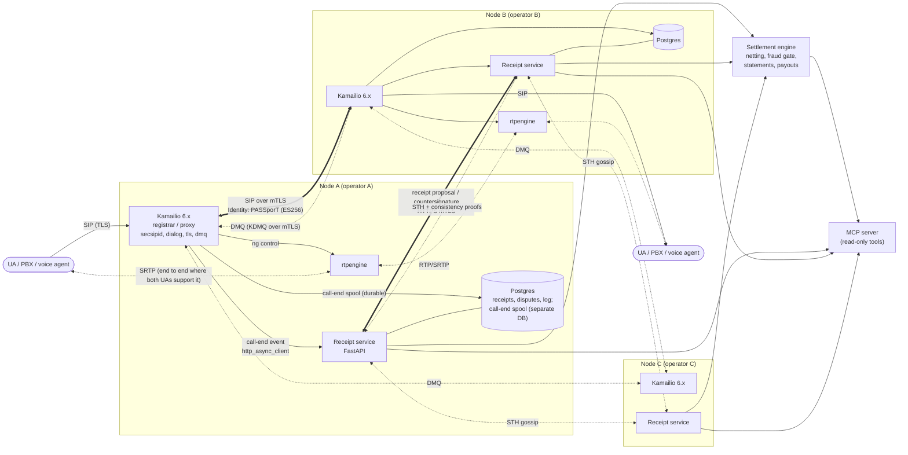
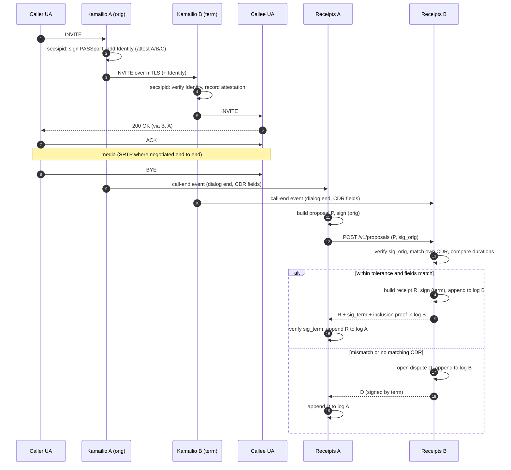
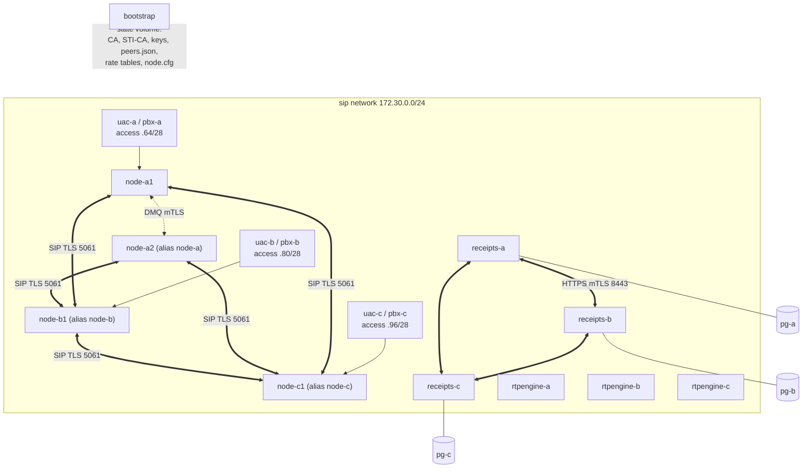

# DOTS 2.0 Architecture (Phase 1)

Status: **accepted** (Milestone 1; decisions in [`PLAN.md`](PLAN.md#decisions-log)). Items marked **[Decision]** need AJ's sign-off; the list is collected in [`PLAN.md`](PLAN.md).

## 1. Scope and trust model

DOTS 2.0 is a settlement and trust layer between independent SIP operators. It answers one question with cryptographic evidence: *what traffic did two operators exchange, and what do they owe each other for it?*

What the system guarantees:

1. **Non-repudiation of agreement.** A receipt is valid only when both the originating and the terminating node have signed it. Neither side can later deny a call it countersigned, or invent one the other side did not sign.
2. **Tamper evidence.** Each node appends every receipt and dispute to its own Merkle log and publishes signed tree heads (STHs). A node cannot drop, alter or reorder a logged entry without breaking a consistency proof that peers already hold.
3. **Reproducible settlement.** A statement is a deterministic function of (dual-signed receipts, signed rate table, fraud-gate verdicts, period). Either party can recompute it bit for bit.

What it does **not** guarantee (stated so nobody over-reads the signatures):

- **Truth of the call.** Two colluding nodes can sign a fake call. A dishonest terminating node can sign a false-answer-supervised call it terminated itself. Dual signatures prove *agreement*, not that audio flowed. That gap is the fraud gate's job (§7), including media evidence from rtpengine and, later, Open Voice Shield.
- **Global non-equivocation.** With bilateral gossip, a node could show different logs to different peers. Phase 1 adds cross-gossip of peer STHs (§6.5) so equivocation is detectable by any third node; it is not prevented.
- **Clock truth.** Timestamps are each node's own NTP clock. Tolerances absorb skew; they do not remove it.

Actors: an **operator** runs one or more **nodes**. A node has a stable `node_id` and is identified to peers through a **peer registry** entry (§4). Phase 1 treats each lab node as a separate operator.

## 2. Component diagram



Per node (lab): Kamailio, rtpengine, receipt service, Postgres. Shared (lab): one settlement engine, one MCP server.

## 3. Call and receipt sequence



Correlation key for matching the proposal with B's own CDR: `(orig_node, call_id, from_tag)`. Call-ID alone is not unique across time or across operators. Phase 1 calls between nodes are direct (A to B, no transit node), and both Kamailio instances run as proxies, so Call-ID and From-tag are preserved end to end. Transit (A to B to C) is a chain of bilateral receipts, one per hop, and is out of scope for Phase 1.

If B's CDR arrives after A's proposal, B queues the proposal for `match_window` (default 60 s). If no CDR shows up, B opens a `missing_term_cdr` dispute. If B has a CDR for a call that came from a peer and no proposal arrives within `proposal_window`, B opens a `missing_proposal` dispute. A proposal that is never answered becomes a `missing_countersignature` dispute on A's side.

## 4. Identities and keys

Each node holds **four distinct keys**. They are deliberately separate: they have different algorithms forced by different standards, different rotation cadences and different blast radii.

| Key | Algorithm | Used for | Where it is trusted |
|---|---|---|---|
| Node signing key | Ed25519 (RFC 8032, pure) | Receipts, disputes, STHs, settlement countersignatures | Peer registry |
| Node agreement key | X25519 (RFC 7748) | Deriving the per-pair destination-hash key (§5.3) | Peer registry |
| SIP TLS key | ECDSA P-256 X.509 | Mutual TLS between Kamailio nodes; HTTPS mTLS between receipt services | Lab CA (Phase 1) |
| STIR/SHAKEN key | ECDSA P-256 (ES256, mandated by RFC 8225/8588) | Signing PASSporTs in the Identity header | Lab STI-CA; cert served at the `x5u` URL |

The brief says "Ed25519 keypair per node". That holds for the receipt layer. SHAKEN *requires* ES256, and TLS stacks expect X.509, so Ed25519 cannot be the only key a node has.

`key_id` = lowercase hex SHA-256 of the raw 32-byte public key.

**Peer registry** (signed since Phase 2 M7; see §4.1): a list of entries

```json
{
  "node_id": "node-b",
  "operator": "Operator B Ltd",
  "sip_uri": "sip:node-b.lab:5061;transport=tls",
  "receipts_url": "https://receipts.node-b.lab:8443",
  "tls_cert_sha256": "…",
  "signing_keys": [{"key_id": "…", "public_key": "base64url", "not_before": 1767225600000, "not_after": null}],
  "agreement_key": "base64url",
  "stir_x5u": "http://node-b:8088/stir/cert.pem",
  "ranges": ["4477", "4420"]
}
```

Keys carry a validity interval so they can be rotated without invalidating old receipts. A signature is checked against the key that was valid at the receipt's `end_ts`. In the lab, all keys and certs are generated at container start by `lab/bootstrap/`; nothing secret is committed.

### 4.1 Signed registry and admission (Phase 2, M7)

The registry is a trust root: it decides who may sign receipts, which number ranges each operator terminates, and where to pay. So no single operator may change it.

- **Entries.** Each member signs its own `RegistryEntry {seq, issued_ts, peer}` (context `dots/v1/registry-entry`) with a key listed in that entry. Other node operators endorse it (context `dots/v1/registry-endorsement`). The file is just the set of signed entries, and anyone may append to it.
- **Anchors.** Every verifier is configured with the founding members' `node_id → key_id` (`anchors.json`), as Certificate Transparency clients pin log keys. Anchors pin *identity*, not content.
- **Admission.** Membership grows from the anchors. A new member is admitted once a strict majority of current node members endorse it; settlement and observer roles need a majority of all nodes.
- **Content.** Every member's entry, founders included, must carry endorsements from a strict majority of the *other* members. For each member, the newest version (`seq`) that qualifies is used. An update that is unendorsed, or signed by a key that is not anchored, simply does not take effect, and the previous entry stays.
- **What this stops.** An operator can't claim another operator's ranges or redirect its payouts. It also can't admit a member on its own. Appending a ring of self-generated members that vouch for each other gains nothing, and neither does appending an imposter entry with a higher `seq`: it can neither join nor evict anyone. Tests cover each case. The lab check appends an imposter and two fake members to the live registry and asserts the accepted view is unchanged.
- **Loading.** `Keyring.load` refuses an unsigned registry, keeps only the accepted entries and logs the rejected ones. A receipt service refuses to start if its own entry is not accepted. `dots-registry verify peers.json anchors.json` prints the verdict for operators.
- **Not yet covered.** Member *removal* (revocation by majority) and anchor rotation. Removal needs signed revocations, a different object, and is left for a later milestone.

## 5. Receipt data model

### 5.1 Encoding rules

- Canonical form is **RFC 8785 JCS** (Python package `rfc8785`). Everything that is hashed or signed is the JCS byte string.
- **No floating-point values anywhere.** JCS serializes numbers as IEEE-754 doubles. Timestamps are integer milliseconds since the Unix epoch, UTC. Durations are integer seconds. Money never appears in receipts. It appears only in statements, and there it is a decimal *string*.
- Binary values (hashes, keys, signatures) are unpadded base64url.
- Every signature uses **domain separation**: the signed message is `ascii(context) || 0x00 || JCS(body)`, where `context` is one of `dots/v1/proposal`, `dots/v1/receipt`, `dots/v1/dispute`, `dots/v1/sth`, `dots/v1/statement`. A signature made for one object type can never validate as another.
- Every object carries `"v": 1`. A body with unknown fields is rejected, not ignored, so two implementations cannot sign different interpretations.

### 5.2 Proposal (signed by the originating node)

```json
{
  "v": 1,
  "type": "proposal",
  "call_id": "a84b4c76e66710@pc33.example",
  "from_tag": "1928301774",
  "orig_node": "node-a",
  "term_node": "node-b",
  "start_ts": 1767225600000,
  "answer_ts": 1767225603120,
  "end_ts": 1767225665500,
  "orig_billed_seconds": 63,
  "dest_prefix": "44207",
  "dest_hash": "base64url(HMAC-SHA256(k_pair_period, E164))",
  "period": "2026-01-01",
  "rate_table": "base64url(SHA-256(JCS(rate_table)))",
  "rate_id": "44207",
  "attestation": "A",
  "orig_key_id": "…"
}
```

- `start_ts` is the time A forwarded the INVITE, `answer_ts` the time A saw the 200 OK, `end_ts` the time A saw the BYE or the dialog timeout.
- `orig_billed_seconds` = `ceil((end_ts - answer_ts) / 1000)`. Raw duration only: billing increments (e.g. 60/60, 1/1) are applied in settlement, from the rate table, not here.
- `period` is derived from `answer_ts` in UTC. It is carried in the receipt so that netting never depends on a server's local timezone.
- `attestation` is `A`, `B`, `C`, or `none` (no Identity header, or verification failed on B). The terminating node reports what it **verified**, not what A claims (§5.4).
- `dest_prefix` is the rate-table prefix that matched (longest match), not a fixed number of digits. It carries no more of the number than billing needs.

### 5.3 Destination hashing (the brief's salted hash, made precise)

A plain salted hash of an E.164 number is **not anonymization**. The space is roughly 10^11 to 10^12 values, so anyone who holds the salt can brute-force it in minutes on a GPU. Under GDPR it is pseudonymous personal data. DOTS therefore uses a keyed hash with a key that third parties never see, and that is destroyed later:

```
k_pair        = HKDF-SHA256(ikm  = X25519(sk_self, pk_peer),
                            salt = "dots/v1/pair",
                            info = sort(node_a, node_b))
k_pair_period = HKDF-SHA256(ikm = k_pair, salt = "dots/v1/dest", info = period)
dest_hash     = HMAC-SHA256(k_pair_period, E164 digits, no '+')
```

- Both peers derive the same key without exchanging it, and nobody else (including the settlement engine and MCP clients) can reverse `dest_hash`.
- Both sides normalize the number to E.164 digits *before* hashing. Normalization runs in Kamailio on each side. A normalization disagreement shows up as a `dest_mismatch` dispute instead of a silent split.
- **Crypto-shredding:** `k_pair_period` is deleted when the dispute window for that period closes (default 30 days after period end). After that, the logged hashes become unlinkable to numbers even for the two peers. The log stays intact, because only the key is destroyed.
- The full number never leaves the operator's own network: it exists only in Kamailio's local call-end spool (§8.3), which is the operator's own CDR store with its own retention policy, outside DOTS.

**[Decision]** Accept HMAC with a per-pair, per-period derived key and crypto-shredding, in place of "hash with a per-period salt".

### 5.4 Receipt (countersigned by the terminating node)

```json
{
  "v": 1,
  "type": "receipt",
  "proposal": { "...": "the proposal body exactly as signed" },
  "sig_orig": "base64url(Ed25519)",
  "term_answer_ts": 1767225603180,
  "term_end_ts": 1767225665420,
  "term_billed_seconds": 63,
  "term_attestation_verified": "A",
  "agreed_billed_seconds": 63,
  "term_key_id": "…"
}
```

The term signature `sig_term` covers `JCS(receipt body)` with context `dots/v1/receipt`. The body embeds the proposal *and* `sig_orig`, so the term signature binds to the exact proposal A signed. The stored, logged object is `{"receipt": body, "sig_term": …}`.

Why it is built this way and not as "both sign the same body": B cannot sign A's numbers when B measured different ones. It has to commit to its own measurement. The two-stage structure (A signs its claim, B signs A's signed claim plus its own observation) needs only one round trip, and the result is still a single object that both parties have signed.

`agreed_billed_seconds` = `min(orig_billed_seconds, term_billed_seconds)`, set by B and accepted by A by storing and logging the receipt. Taking the minimum means neither side is paid for seconds the other side did not observe. **[Decision]** min rule (alternative: the terminating side's value, as in typical wholesale invoicing).

B countersigns only if **all** of these hold. Otherwise it emits a dispute:

| Check | Dispute kind if it fails |
|---|---|
| `sig_orig` is valid under A's key valid at `end_ts` | `bad_signature` |
| B has a CDR matching `(orig_node, call_id, from_tag)` | `missing_term_cdr` |
| `abs(orig_billed - term_billed) <= max(tol_abs, tol_rel × max(orig, term))` | `duration_mismatch` |
| `abs(answer_ts - term_answer_ts) <= tol_skew` | `timestamp_skew` |
| `dest_hash` matches B's own HMAC of its number | `dest_mismatch` |
| `rate_table` is the current agreed table and `rate_id` matches B's longest prefix match | `rate_mismatch` |

Proposed defaults: `tol_abs = 2 s`, `tol_rel = 1%`, `tol_skew = 2 s`. **[Decision]** Tolerances. These are an open question in the brief.

A call that is never answered produces no proposal: there is nothing to bill. ASR statistics come from each node's local CDRs, not from receipts.

### 5.5 Dispute

```json
{
  "v": 1,
  "type": "dispute",
  "kind": "duration_mismatch",
  "call_id": "…", "from_tag": "…",
  "orig_node": "node-a", "term_node": "node-b",
  "raised_by": "node-b",
  "period": "2026-01-01",
  "proposal": { "...": "if one exists" },
  "sig_orig": "… if one exists",
  "observed": { "term_billed_seconds": 41 },
  "raised_ts": 1767225666000,
  "key_id": "…"
}
```

The dispute is signed by `raised_by` (context `dots/v1/dispute`), logged by the raiser, sent to the peer, and logged by the peer as received. A dispute is never paid. It stays in both logs as the call's outcome until the operators resolve it (§5.7).

### 5.6 Why disputes stay in the log

A log is append-only, so "closing" a dispute cannot mean editing or removing it. A resolution is a new entry that refers to the dispute by leaf hash. Anyone holding both logs can then see the disagreement, how it was settled, and that both parties signed the settlement.

### 5.7 Dispute resolution (Phase 2, M10)

A dispute is resolved by **re-proposal**. The result is an ordinary dual-signed receipt that names the dispute it settles:

```json
{
  "receipt": {
    "...": "every field of §5.4",
    "resolves": "<leaf hash of the dispute (base64url)>"
  },
  "sig_term": "…"
}
```

`resolves` is covered by the terminating node's signature (context `dots/v1/receipt`), so a resolution cannot be moved to another dispute. On an ordinary receipt the field is absent rather than `null`, so receipts signed before M10 keep exactly the same bytes. Because a resolution is a receipt, every downstream path works unchanged: inclusion proofs, monitoring, settlement, the fraud gate and peer recomputation. `agreed_billed_seconds` is still `min(orig, term)`.

Flow:

1. **The originating operator decides to settle** (`POST /internal/disputes/{leaf}/resolve`). The node re-proposes the call. It reuses the disputed proposal byte for byte when the dispute carries it, and otherwise builds one from its own CDR (a `missing_proposal` dispute). It sends `{dispute, proposal}` to `POST /v1/resolutions` on the terminating node and retries from an outbox until the outcome is final.
2. **The terminating node checks** the request: the sender is the originator; the dispute and proposal signatures verify; both refer to the same call; the kind is resolvable (not `bad_signature` or `unknown_peer`); and the dispute window (30 days after the period, D2) is still open.
3. **It countersigns at once only if it concedes nothing.** Its own CDR must match the destination and rate, and the agreed duration may not fall below its own measurement by more than the tolerance. Timing differences alone (`timestamp_skew`) do not block. Otherwise it answers `202 needs_approval` and parks the request for its operator.
4. **Concessions need the terminating operator's approval** (`POST /internal/disputes/{leaf}/approve`). With approval it signs its real measurement (the minimum rule then pays the originator's figure). If it has no record of the call at all, it signs the originator's timestamps and vouches for no attestation (`term_attestation_verified: "none"`).
5. **Both nodes log the resolution receipt** and link it to the dispute (`resolutions` table, one per call). `GET /v1/calls/{call_key}` returns the dispute plus the resolution and its inclusion proof. `GET /v1/resolutions` lists them for the settlement engine.

**One receipt per call.** Suppose the terminating node had already countersigned the call, but the originator never got that receipt (it logged `missing_countersignature`). The terminating node then returns that same receipt, not a second one, and both logs end up holding it. The engine enforces the same rule independently (§7.7).

Each step is authorized by the operator who would lose by it. The originator re-proposes, which accepts at most its own figure. The terminating node signs only what it measured, unless its operator approved the concession. Adjudication by a third party is deliberately not part of the protocol. The two parties' signatures are what settlement relies on, so an adjudicator's ruling would still have to end in a re-proposal and a countersignature.

## 6. Merkle log

### 6.1 Structure

Each node keeps one append-only log. The tree is **RFC 9162 §2.1**:

- `MTH({}) = SHA-256()`
- `MTH({d0}) = SHA-256(0x00 || d0)` (leaf hash)
- `MTH(D[n]) = SHA-256(0x01 || MTH(D[0:k]) || MTH(D[k:n]))`, where k is the largest power of two smaller than n.

Inclusion proofs and consistency proofs follow the RFC 9162 generation and verification algorithms (§2.1.3, §2.1.4; verification in §2.1.3.2 and §2.1.4.2). RFC 9162 makes the hash algorithm a log parameter; DOTS fixes it to SHA-256 for all logs. DOTS uses RFC 9162's **tree and proof structure only**. It does not use the CT TLS-encoded `TransItem`, SCT or precertificate wire formats, which are certificate-specific.

Leaf data `d` = `JCS(entry)`, where an entry is a signed receipt (`{"receipt":…, "sig_term":…}`) or a signed dispute. Each node logs both kinds. The two peers' logs therefore each contain the identical byte string for a given receipt, and each side can demand an inclusion proof from the other.

### 6.2 Signed tree head

```json
{ "v": 1, "type": "sth", "log_id": "node-a", "tree_size": 1042,
  "root_hash": "base64url", "timestamp": 1767225700000, "key_id": "…" }
```

Signed with Ed25519, context `dots/v1/sth`. Published every `sth_interval` (default 10 s) when the tree has grown, and at least every 5 minutes otherwise, so a stale log is distinguishable from a stopped one.

### 6.3 Storage

Postgres table `log_leaves(idx bigint primary key, leaf_hash bytea unique, kind, call_key, period, orig_node, term_node, entry jsonb, entry_jcs bytea)`. A statement-level trigger rejects `UPDATE`, `DELETE` and `TRUNCATE`. The receipt service runs as one process per node; appends are serialized by an in-process lock and committed in the same transaction as the call's outcome row, so a call can never have an outcome without a log entry. Leaf hashes are held in memory (32 bytes per leaf, loaded at start-up and checked for gaps) and the hash of every complete, aligned power-of-two subtree is memoized, so roots and proofs are O(log n) after warm-up. STHs are stored in `sths`.

### 6.4 Receipt-service API (peer-facing, HTTPS mTLS)

| Method | Path | Purpose |
|---|---|---|
| POST | `/v1/proposals` | A to B: submit a signed proposal; response is a receipt or a dispute |
| POST | `/v1/disputes` | Deliver a dispute to the peer |
| GET | `/v1/sth` | Latest STH |
| GET | `/v1/sth/consistency?first=m&second=n` | Consistency proof |
| GET | `/v1/proof/inclusion?leaf_hash=…&tree_size=n` | Inclusion proof |
| GET | `/v1/entries?start=i&end=j` | Raw log entries (peers and settlement only; never public) |
| GET | `/v1/peers/sths` | Latest verified STHs this node holds for its peers (gossip) |
| GET | `/v1/calls/{call_key}` | Outcome of one call: entry, leaf index, latest STH, inclusion proof |
| GET | `/v1/alarms` | Integrity alarms and frozen peers |
| GET | `/v1/cdr-stats?period=` | Attempt, answer and no-media counts per peer/prefix (settlement and observer roles only) |
| POST | `/v1/resolutions` | Originator to terminator: settle a dispute on a re-proposal (§5.7); answers a receipt, `202 needs_approval` or `409` |
| GET | `/v1/resolutions?since_ms=` | Resolved disputes: dispute leaf, resolution receipt leaf, period, pair |

**Authentication.** Every `/v1` request is signed: `X-DOTS-Node`, `X-DOTS-Key`, `X-DOTS-Ts` and `X-DOTS-Sig`, an Ed25519 signature (context `dots/v1/request`) over `{method, path+query, ts, sha256(body)}`, valid for ±60 s. The transport is HTTPS with the lab CA, and the server requires a client certificate. Since Phase 2 M8 the two are bound together. `PeerCertH11Protocol` (uvicorn's h11 protocol plus one hook) exposes the verified client certificate through the standard ASGI TLS extension. Every request must then present the certificate whose SHA-256 the signed registry records for the signer (`tls_cert_sha256`), so a stolen signing key is useless without the matching certificate, and a node's certificate cannot carry another node's signature (`DOTS_REQUIRE_TLS_BINDING`, on in the lab). A proposal is accepted only from its `orig_node`, and a dispute only from its `raised_by`. Nodes see only the log entries they are a party to; `settlement` and `observer` roles see all entries. `call_key` = base64url(SHA-256(JCS([orig_node, call_id, from_tag]))).

Local-only (plain HTTP on the node's internal network, bearer token, used by Kamailio and the operator): `POST /internal/call-end`, `POST /internal/tick` (run all periodic work now; used by the lab tests), `GET /internal/disputes` (open disputes, re-proposals in flight, requests awaiting approval), `POST /internal/disputes/{leaf}/resolve` and `/approve` (§5.7), `GET /healthz`.

**Pseudonymization at ingestion.** On `call-end` the service immediately turns the event into a `LocalCdr`: it derives the period, computes `dest_hash` with the pair/period key, resolves the rate-table prefix and `rate_id`, and then discards the number. The terminating node compares these precomputed values with the proposal. No table in the receipt service holds a full number.

### 6.5 Monitoring and gossip

Every `sth_interval`, each node:

1. Fetches each peer's STH and verifies the signature.
2. Fetches a consistency proof from the last STH it accepted to the new one, and verifies it. A failure is a **log-integrity alarm**: settlement with that peer is frozen.
3. For each receipt it countersigned or received since the last check, verifies its inclusion in the peer's log at the new STH. A receipt missing from the peer's log after `mmd` (maximum merge delay, default 60 s) raises an alarm.
4. Republishes the peer STHs it accepted at `/v1/peers/sths`. A third node comparing A's view of B with its own view of B detects equivocation (two valid STHs for the same `tree_size` with different roots, or STHs that are not mutually consistent).

### 6.6 Optional anchoring (off by default)

Interface `Anchor.publish(sth_hash) -> AnchorProof` and `Anchor.verify(sth_hash, proof)`. Shipped adapters: `none` (default) and `opentimestamps` (stub in Phase 1). No chain library is imported by the core: adapters are loaded only by configuration.

## 7. Settlement

### 7.1 Inputs

- Dual-signed receipts with `period = P`, taken from **both** peers' logs. A receipt counts only if it appears with identical bytes in both logs, with inclusion proofs against STHs at or after the period cutoff.
- The **rate table**: a JCS document signed by both operators, containing `{table_id, currency, effective_from, effective_to, entries: [{prefix, rate_per_min, interval_1, interval_n, direction}]}`. `direction` is the payer, A to B or B to A. Rates are decimal strings. Receipts reference it by hash, so a rate change mid-period is explicit (both tables appear as inputs).
- Fraud-gate verdicts for each receipt (§7.3).

### 7.2 Netting

For the pair (A, B) and period P:

```
billable(r) = interval_1                                              if s <= interval_1
              interval_1 + ceil((s - interval_1)/interval_n) × interval_n   otherwise
              where s = agreed_billed_seconds
charge(r)   = billable(r) / 60 × rate_per_min        (Decimal, exact)
gross_ab    = Σ charge(r)  over passed receipts where A originated, B terminated
gross_ba    = Σ charge(r)  over passed receipts where B originated, A terminated
net         = gross_ab − gross_ba                    (> 0: A pays B)
```

Arithmetic is Python `Decimal` with a fixed context (precision 28). Rounding happens **once**, on each gross total, to the currency's minor unit with `ROUND_HALF_EVEN`, never per call. That is the usual source of off-by-one-cent statements between carriers, so the rule is fixed in the spec and in tests. A zero-second call (answered then hung up immediately) still bills `interval_1`, per the table. That matches common wholesale practice and is a known IRSF lever: the fraud gate weights it.

**Cutoff:** a period closes at `P_end + grace` (default 6 h). Receipts for P that are logged after the cutoff are settled in the next statement as `late_adjustments`, never by reopening a signed statement.

### 7.3 Fraud gate

```python
class Verdict(Enum): PASS = "pass"; HOLD = "hold"; REJECT = "reject"

@dataclass(frozen=True)
class Score:
    verdict: Verdict
    reasons: tuple[str, ...]      # machine codes, e.g. "short_burst", "acd_anomaly"
    engine: str                   # "local_rules@1", "ovs@…"

class FraudGate(Protocol):
    def score(self, receipt: Receipt, ctx: PeriodContext) -> Score: ...
```

`ctx` carries per-period aggregates (pair, prefix and per-minute windows). Single-receipt scoring cannot detect bursts or ASR/ACD shifts, so the signature extends the brief's `score(receipt)` with a context argument.

`local_rules` (Phase 1):

| Rule | Signal | Default verdict |
|---|---|---|
| `short_burst` | ≥ N calls with `agreed_billed_seconds <= 6` to the same `dest_prefix` within 60 s | hold |
| `acd_anomaly` | Prefix ACD below a fraction of its trailing baseline, or a spike in one-interval calls | hold |
| `asr_anomaly` | ASR (from local CDR counts reported by the originating node) out of band | hold |
| `high_risk_prefix` | `dest_prefix` in the configured IRSF high-risk list | hold (configurable to reject) |
| `duration_skew` | Systematic within-tolerance bias of term over orig durations (padding, FAS-like) | hold |
| `no_media` | rtpengine reported zero RTP packets in one direction on an answered call | hold |

**Per-route baselines (Phase 2, M9).** The engine records each settled period's metrics per route `(orig, term, prefix)`: calls, agreed seconds, attempts, answered. When a route has at least 3 days of history in the trailing 7, its own baseline replaces the fixed thresholds:
- `acd_anomaly` fires when today's ACD falls below half the route's usual.
- `asr_anomaly` fires when today's ASR falls below half the route's usual.
- `volume_spike` (new) fires when today's calls exceed 5× the route's usual daily volume and at least 50 calls, the signature of traffic pumping.

Routes without history keep the absolute thresholds. Re-running a period replaces its metrics rather than counting them twice.

Hard duration mismatches never reach the gate: they are disputes at receipt time (§5.4). The gate's `duration_skew` rule covers the subtler case, where every call passes the tolerance but is skewed in the same direction.

`no_media` uses a local, unsigned signal from the originating node (rtpengine stats on the call-end event). It is not part of the receipt, because media stats are not agreed facts.

`ovs` adapter: config keys `OVS_BASE_URL`, `OVS_API_KEY`, `OVS_TIMEOUT_MS`, `OVS_FAIL_MODE` (`hold` | `pass`). The HTTP client raises `NotImplementedError` (TODO). If the adapter is enabled and unreachable, the gate fails closed (`hold`) by default.

Gates compose: the effective verdict is the most severe one (reject > hold > pass), and all reasons are kept.

### 7.4 Settlement statement

```json
{
  "v": 1, "type": "statement",
  "pair": ["node-a", "node-b"], "period": "2026-01-01", "currency": "USD",
  "rate_tables": ["base64url hash"],
  "log_refs": { "node-a": {"tree_size": 1042, "root_hash": "…"},
                "node-b": {"tree_size": 998,  "root_hash": "…"} },
  "receipts_root": "base64url(RFC 9162 MTH over sorted leaf hashes of included receipts)",
  "counts": { "passed": 812, "held": 14, "rejected": 0, "disputed": 3 },
  "gross": { "node-a->node-b": "123.4500", "node-b->node-a": "98.1000" },
  "held_amount": { "node-a->node-b": "1.2000" },
  "late_adjustments": [],
  "net": { "payer": "node-a", "payee": "node-b", "amount": "25.35" },
  "engine_version": "settlement@0.1.0",
  "generated_ts": 1767312000000
}
```

`receipts_root` commits to exactly which receipts were settled, so either party can prove or contest the inclusion of a specific call.

Signatures: the settlement engine signs (context `dots/v1/statement`), then **each peer independently recomputes the statement from its own copies of the inputs** and countersigns it if the bytes match. A statement is *final* only with all three signatures. That keeps the single lab settlement engine from becoming a trusted third party. **[Decision]** Require peer countersignature for finality (the brief asks only for the engine's signature).

Outputs: `statement.json` (signed) and `statement.html` (rendered from the JSON with Jinja2; it prints to PDF from a browser, so there is no PDF toolchain in Phase 1).

### 7.5 Payout

```python
class Payout(Protocol):
    name: str
    def pay(self, ss: SignedStatement) -> dict: ...
```

- `fiat_stub`: writes an invoice record (JSON under `/data/invoices`, plus a row in the engine store) with statement id, issuer (payee), bill-to (payer), amount, currency and due date.
- `stablecoin_testnet`: builds and signs an EIP-1559 `transfer(address,uint256)` of testnet USDC (6 decimals) from the **payer's** testnet wallet to the payee's `settlement_address` in the peer registry.
  - It refuses any chain id outside a testnet allow-list (Base Sepolia, Ethereum Sepolia, Arbitrum Sepolia, OP Sepolia).
  - Before broadcasting, it checks that the RPC endpoint reports the same chain id.
  - It runs in dry-run mode by default: sign, record the raw transaction, do not broadcast.
  - Wallet keys are generated by the lab bootstrap. They exist only in the lab state volume and are never committed. In the lab the engine signs with the payer's key to simulate the payer's wallet tooling; outside the lab, the payer runs the adapter itself, so the engine never holds funds or keys (no custody).
  - CI checks the calldata, the signature (sender recovery) and the RPC chain-id guard against a mocked RPC. Nothing is broadcast to a public testnet in CI.

Only `final` statements with a non-zero net are paid. Payout records are idempotent on (statement id, adapter).

### 7.6 As built (Milestone 4)

- **Engine** (`services/settlement`): FastAPI + SQLite store at `/data`, plus a scheduler that settles the previous UTC day once its grace period (6 h) has passed. A pair with no traffic still gets a zero statement, which attests that nothing was exchanged. `POST /v1/run?period=…` triggers a run; `force=true` (settling a period that is still open) is honored only in lab mode.
- **Collection**: for each pair, both logs' receipts for the period below each log's STH. Only receipts present byte-identically in both logs are settled, each with an inclusion proof verified against both STHs and a full signature re-verification. Settlement refuses to run for a pair while either node has frozen the other after an integrity alarm.
- **Fraud context**: the receipts of the pair and period, attempt/answer counts from each originating node (`/v1/cdr-stats`), and per-call rtpengine packet counts from each originating node (`/v1/media`). The rules and their thresholds are in `fraud.py` (`RulesConfig`).
- **Exclusions are explicit**: the statement lists `excluded` leaves (`unmatched`: present in one log only; `already_settled`: covered by an earlier final statement, so re-running a period yields a supplementary statement). Held and rejected receipts are listed with reasons.
- **Peer recompute**: `POST /v1/statements/ack` on each node, settlement role only. The node checks the engine signature, checks that `log_refs[self]` matches its own tree, and recomputes the receipt sets, both roots, gross totals and net from its own log and rate tables (`dots_common.settlement.recompute_check`). It countersigns with context `dots/v1/statement-ack` only if everything matches; any mismatch raises a `statement_mismatch` alarm. The engine's fraud verdicts are inputs to that recomputation. A peer that disagrees with a hold does not countersign, and the statement stays pending.

### 7.7 Resolutions and supplementary statements (Phase 2, M10)

- A resolution receipt belongs to the call's original period. If that period is still open, the regular run settles it like any other receipt.
- If the period was already settled, the scheduler (and `POST /v1/supplementary`) picks up new resolutions from every node's `GET /v1/resolutions`. It builds a **supplementary statement** for each affected (pair, period). That statement covers only receipts not settled before; earlier ones are listed as `already_settled`. It is signed, recomputed and countersigned by both peers like any statement, and it counts `resolved` receipts.
- **One paid receipt per call.** The engine records the call key of every settled receipt. A receipt whose call was already paid through another receipt is excluded as `duplicate_call`, and so are two matched receipts for one call in the same run. Either case can only arise if a peer signed twice, so neither receipt is paid and the operators sort it out.

## 8. SIP node design

As built in Milestone 3: `node/kamailio/kamailio.cfg`, plus `instance.cfg` (written by the container entrypoint) and `node.cfg` (generated by the lab bootstrap from the peer registry).

| Concern | Choice |
|---|---|
| Kamailio | **6.0.5** from the Ubuntu 26.04 LTS archive (`kamailio`, `kamailio-tls-modules`, `kamailio-secsipid-modules`, `kamailio-json-modules`, `kamailio-extra-modules`, `kamailio-utils-modules`). Upstream latest stable is 6.1.4; `--build-arg BASE_IMAGE=ubuntu:24.04 --build-arg KAMAILIO_REPO=kamailio61` builds from `deb.kamailio.org` instead. That variant is a manual option: `deb.kamailio.org:443` was unreachable from both this build environment and GitHub-hosted runners on 2026-10-04, so CI does not exercise it. See decision D9 in PLAN.md. Do not use the Docker Hub `kamailio/kamailio-ci` images: they stop at 5.5.2 |
| Config | No template engine. `#!substdef` values in `instance.cfg` (addresses, DMQ peer, rtpengine socket, receipt-service URL and token) and `node.cfg` (node id, STIR key and x5u, generated `DOTS_RANGES` and `DOTS_PEER` routes) |
| Customer side | UDP 5060. Calls from the operator's access subnet (`is_in_subnet`) are originations; the operator's PBX registers AOR `pbx` from the same subnet |
| Federation side | TLS 5061, `verify_certificate` + `require_certificate`, lab CA. The peer is the CN of its verified client certificate (`$tls_peer_subject_cn`), which must be a registry node. A peer may only send numbers in our own ranges (no transit in Phase 1) |
| Number routing | Static E.164 ranges per node from the peer registry, compiled to a longest-prefix route (§8.1) |
| Registrar replication | `dmq` + `dmq_usrloc` over mutual TLS, **inside one operator's cluster only**. KDMQ is accepted only over TLS with a verified certificate whose CN is our own node id |
| STIR/SHAKEN | `secsipid` (libsecsipid). Originating side: `secsipid_add_identity(src, dst, "A", "", x5u, key)` with the node's ES256 STIR key. x5u is `http://<node>:8088/stir/cert.pem`, served by Kamailio itself through `xhttp`. Terminating side: `secsipid_check_identity("")` fetches x5u and validates the certificate against the lab STI-CA (`libopt CertVerify=5`: time validity + custom root), then reads `attest` from the PASSporT. In production SHAKEN certificates must chain to an STI-PA-approved CA |
| Dialog state / timing | `dialog` (`dlg_manage`). Millisecond timestamps from `$TV(Sn)` stored in dialog vars at INVITE (`start`) and in `event_route[dialog:start]` (`answer`) |
| Media | rtpengine (**mr13.5.1.4** from the Ubuntu 26.04 archive, userspace forwarding) through `rtpengine_manage()`. Each operator anchors media on its own rtpengine. Per-leg packet counts are read with `rtpengine_query_v()` at dialog end (§8.2) |
| Call-end event | `http_async_client` from `event_route[dialog:end]` and `event_route[dialog:failed]` (§8.3) |

### 8.1 What DMQ replicates (a correction to the brief)

The brief asks for "registrar replication between peers with `dmq` + `dmq_usrloc`". Full `usrloc` replication across **independent operators** causes three problems:

1. **It leaks subscriber data.** Every operator would receive every other operator's contacts (AORs, contact URIs, received IPs, user agents).
2. **It breaks the receipt model.** If B holds A's contacts, B can route straight to A's subscribers without traversing A. A then never sees the call and can never countersign it.
3. **It does not work behind NAT.** A contact behind NAT is reachable only through the socket of the node it registered on (`received`/Path). A replicated contact on another operator's node is unusable.

As built:

- **Within one operator** (an HA cluster of that operator's instances): `dmq` + `dmq_usrloc`, full replication, over mutual TLS.
- **Between operators**: no DMQ at all. Reachability is the operator's **E.164 ranges**, published in the peer registry (signed per operator from Phase 2) and compiled into each node's routing script. The Milestone 1 draft proposed a DMQ-replicated `htable` for this. That was dropped: number ranges are static, contractually assigned operator data, so they belong in the registry, not in a replicated cache that any cluster member could write. Sharing a DMQ bus with other operators would also mean accepting KDMQ writes from them.

In the lab, operator A runs **two instances** (`node-a1`, `node-a2`) that share node-a's identity and receipt service. A's PBX registers on `node-a1` only, while the federation name `node-a` resolves to `node-a2`. Every call into operator A therefore works only if `dmq_usrloc` has replicated the contact, and the lab exercises that on every run.

### 8.2 SRTP and rtpengine (a correction to the brief)

"rtpengine" and "SRTP end to end" conflict as written. When rtpengine anchors a call and *translates* SRTP (SDES re-keying, or terminating DTLS), it holds the media keys, so encryption is hop-by-hop. The target design:

- When both endpoints offer SRTP with the same profile, rtpengine relays packets **without touching the crypto**, acting only as a NAT-traversal relay. It still sees packet counts and timing for the `no_media` rule.
- RTP↔SRTP bridging is allowed but marked `media.e2e=false` in the call-end event.

**Status:** the lab runs plain RTP/AVP (SIPp plays G.711 A-law from `g711a.pcap`, and the PBX echoes it). SRTP passthrough is **not yet verified** in the lab, and `media.e2e` is always reported `false`. Verifying it needs an SRTP-capable test agent; this is listed as follow-up work in PLAN.md.

### 8.3 Call-end event transport: `http_async_client`, not `evapi`

| | `http_async_client` | `evapi` bridge |
|---|---|---|
| Moving parts | One module and a FastAPI endpoint | A module, a custom long-lived TCP consumer with netstring framing, then HTTP |
| Kamailio worker blocking | None (`$http_req(suspend)=0`, fire and forget from the dialog event route) | None |
| Loss when the receiver is down | Request fails, logged | Event dropped if no client is connected |
| Backpressure / retries | Per-request timeout; the receiver is idempotent on `(call_key, direction)` | Must be built in the bridge |
| Auth | Bearer token from the lab state | Same |

**Choice: `http_async_client`.** With equal loss semantics, it has fewer moving parts.

Neither transport is durable on its own, so every event is also written to a **durable call-end spool** (Phase 2, M6):

- **Write.** In `route[CALL_END]`, Kamailio inserts the exact event JSON into `call_end_spool` in a `kamailio` database on the operator's own Postgres, through `sqlops` `sql_query_async` (async workers, so SIP workers never wait on the database). The JSON is base64-encoded in the script (`{s.encode.base64}`) and decoded by Postgres, so no SIP-controlled value (Call-ID, tags) is ever quoted into SQL text. Kamailio's database role may only `INSERT` into that table.
- **Read.** The receipt service reconciles from the spool every `reconcile_interval_s` (60 s; 5 s in the lab), with a cursor in its own database. Ingestion is idempotent on `(call_key, direction)`, so events that also arrived over HTTP count as duplicates. A malformed row is logged by id (never by content) and skipped.
- **Why not `acc`.** The spool carries the same JSON as the HTTP event: millisecond timestamps, attestation, Identity verification, and rtpengine media counts. `acc` dialog CDRs have second-resolution times and none of those fields, so a reconciled `acc` row would bill differently from the same call delivered over HTTP.
- **Retention.** Rows contain full numbers. They stay in the operator's own database under its own retention policy; the receipt service never writes to or copies from the spool beyond the pseudonymized `LocalCdr`.

The lab proves both sides of the boundary:
- **Short outage** (`recovery` group): an originating receipt service is stopped during 3 calls and restarted 5 s later. It recovers the events from the spool, and the calls settle as normal receipts.
- **Long outage** (`outage` group): the window is longer than the peer's countersignature window. The peer's signed `missing_countersignature` disputes stand, and the late-recovered events do not reopen them.

The event JSON is built with `jansson_set` (integers above 2^31 are passed as strings, as the module requires). Fields: `node_id, call_id, from_tag, direction, peer_node, status, sip_code, start_ts, answer_ts, end_ts, src, dst, attestation, identity_verified, media {pkts_in, pkts_out, e2e}`. The full numbers travel only to the local receipt service, which pseudonymizes them on arrival (§6.4).

## 9. Lab topology



`bootstrap` runs first. It writes every key, certificate and generated config into the `state` volume, then exits; all services wait for it. Each Postgres instance sits on an internal-only network with its receipt service.

SIPp scenarios (`lab/scenarios.json`, run by `lab/run_e2e.py`):

| Group | Calls | Expected |
|---|---|---|
| `normal` | A→B mobile ×10 (7.4 s, 1/1 billing), A→B London ×5, B→C ×8, C→A ×6, B→A ×4 (10.4 s) | One identical dual-signed receipt per call in both logs, billed 8 s / 11 s, attestation A verified by the terminating node |
| `short_burst` | A→B ×40 at 10 cps, 2.4 s each | Receipts valid; settlement **holds** them (`short_burst`, Milestone 4) |
| `duration_mismatch` | A→C ×5; node-c's receipt service adds 15 s to its own measurement (`DOTS_LAB_SKEW`, honored only with `DOTS_LAB_MODE`) | **Disputes** `duration_mismatch` in both logs; excluded from settlement |
| `outage` | B→C ×3 while node-c's receipt service is stopped; after the countersignature window (30 s in the lab) node-c comes back, then every receipt service is restarted | node-b raises signed `missing_countersignature` disputes and delivers them once node-c is back (same bytes in both logs); logs reload from Postgres with consistent tree heads and no integrity alarms; the calls are never settled |

Durations avoid whole seconds, so `ceil()` is stable under jitter: 7.4 s bills 8 s. Expected values come from the scenario file, never from the system under test.

## 10. Code layout and tooling

```
services/
  common/        dots_common: jcs, signing (domain-separated Ed25519), identity and
                 signed requests, dest (X25519/HKDF/HMAC), merkle (RFC 9162), models,
                 protocol (proposal/receipt/dispute), settlement (netting, statements),
                 client (signed sync client)
  receipts/      dots_receipts: FastAPI peer + internal APIs, Postgres (schema.sql),
                 log and STHs, proposal exchange, disputes, monitor and gossip, acks
  settlement/    dots_settlement: engine, fraud gate (local rules, OVS stub),
                 statements (JSON + HTML), payouts (fiat_stub, stablecoin_testnet)
  mcp/           dots_mcp: read-only MCP server (mcp 2.3.0, MCPServer)
  Dockerfile     one image for all Python services (runtime and tester targets)
node/kamailio/   kamailio.cfg, entrypoint (instance.cfg + tls.cfg), Dockerfile
node/rtpengine/  entrypoint, Dockerfile
lab/             topology.json, scenarios.json, bootstrap (dots_lab), sipp/,
                 run_e2e.py, tests/ (inside the lab), unit/ (bootstrap tests)
docker-compose.yml  the lab
```

- Python 3.12, a **uv** workspace with one lockfile, FastAPI, Pydantic v2, `cryptography` (Ed25519, X25519, HKDF, X.509), `rfc8785`, `psycopg` 3 with a pool, `eth-account` (testnet payouts only). The schema is one idempotent `schema.sql` applied at start-up under an advisory lock; there are no migrations yet.
- `ruff` (lint + format), `mypy --strict` on every package, `pytest`, and hypothesis property tests for the Merkle proofs. CI runs the same checks plus the full lab end to end.
- Pinned versions (verified 2026-10-04): 

| Component | Version | Notes |
|---|---|---|
| Kamailio | 6.0.5 (Ubuntu 26.04), 6.1.4 optional | modules used: tls, dmq, dmq_usrloc, usrloc, registrar, dialog, secsipid, rtpengine, http_async_client, jansson, xhttp, ipops |
| rtpengine | mr13.5.1.4 (Ubuntu 26.04 `rtpengine-daemon`) | upstream latest is mr26.2.1.2; mr13.5 is a maintained LTS line (mr13.5.1.27, 2026-09) |
| Python | 3.12 | per brief |
| fastapi | 0.142.x | |
| pydantic | 2.13.x | |
| cryptography | 50.x | Ed25519, X25519, HKDF |
| rfc8785 | 0.1.4 | Trail of Bits JCS implementation |
| psycopg | 3.3.x | |
| mcp | 2.3.0 | 2.x renamed `FastMCP` to `MCPServer`, removed `mcp.server.fastmcp`; transport args moved to `run()` |
| USDC testnet | Base Sepolia, chain id 84532, `0x036CbD53842c5426634e7929541eC2318f3dCF7e` | Circle testnet USDC. The address comes from Circle's documentation via search results; developers.circle.com was unreachable from the build environment, so check it before any broadcast |


## 11. Agent interface (MCP)

`services/mcp` exposes five tools, all annotated read-only, idempotent and non-destructive. There are no write or payout tools in Phase 1.

| Tool | Returns | Verified locally before reporting |
|---|---|---|
| `list_peers` | Nodes (ranges, latest STH, alarm count, frozen peers) and the settlement/observer services | STH signatures |
| `get_receipt` | A call's outcome in one node's log: receipt summary (durations, prefix, rate, attestation) or dispute | Both receipt signatures, or the dispute signature |
| `verify_inclusion` | Inclusion of a call's entry in **both** parties' logs, with leaf index, tree size and root | STH signatures and RFC 9162 inclusion proofs |
| `get_settlement` | Statements by period or pair, or one statement in full (directions, net, held with reasons, payouts) | Engine signature and each peer's countersignature |
| `list_disputes` | Disputes in a node's log, filterable by kind | Dispute signatures |

The server signs its requests as the `observer` identity, so it sees every entry but cannot propose, dispute or acknowledge anything. Output never contains numbers or destination hashes. It runs over stdio (default) or streamable HTTP; the lab serves streamable HTTP at `http://127.0.0.1:8000/mcp`. To connect Claude Code to the lab:

```sh
claude mcp add --transport http dots http://127.0.0.1:8000/mcp
```

## 12. Security notes

- **No secrets in git.** `.env.example` documents every variable. Lab keys are generated by `bootstrap` into Docker volumes. `.gitignore` covers `*.pem`, `*.key` and `.env`.
- **Constant-time verification** comes from `cryptography`. Signature checks never short-circuit on `key_id` lookup errors in a way that leaks which node's key is unknown.
- The receipt service's peer API requires mTLS. The client cert fingerprint must map to the `node_id` claimed in the body, so node B cannot submit a proposal "from" C.
- **Replay:** proposals are unique on `(orig_node, call_id, from_tag)`. A duplicate returns the stored result idempotently and never creates a second receipt.
- The `stablecoin_testnet` adapter hard-fails on any chain id outside a testnet allow-list.
- The MCP server is read-only, and binds to the lab network only. Its tools return `dest_prefix`, never `dest_hash` key material.
