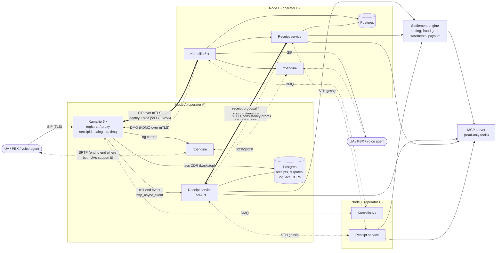
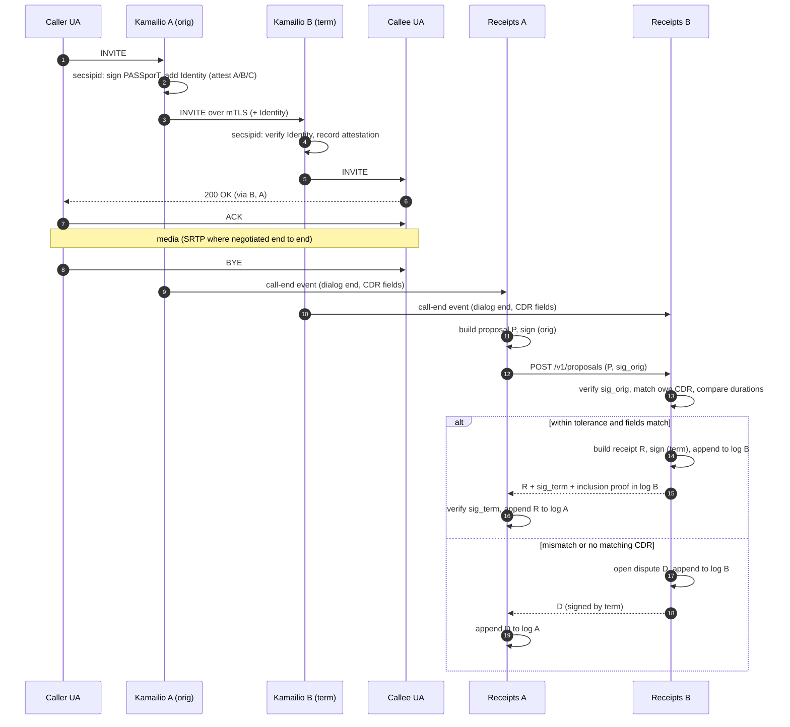
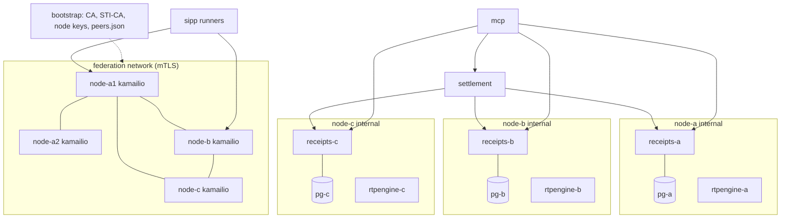

# DOTS 2.0 Architecture (Phase 1)

Status: **draft for review** (Milestone 1). Items marked **[Decision]** need AJ's sign-off; the list is collected in [`PLAN.md`](PLAN.md).

## 1. Scope and trust model

DOTS 2.0 is a settlement and trust layer between independent SIP operators. It answers one question with cryptographic evidence: *what traffic did two operators exchange, and what do they owe each other for it?*

What the system guarantees:

1. **Non-repudiation of agreement.** A receipt is valid only when both the originating and the terminating node have signed it. Neither side can later deny a call it countersigned, or invent one the other side did not sign.
2. **Tamper evidence.** Each node appends every receipt and dispute to its own Merkle log and publishes signed tree heads (STHs). A node cannot drop, alter or reorder a logged entry without breaking a consistency proof that peers already hold.
3. **Reproducible settlement.** A statement is a deterministic function of (dual-signed receipts, signed rate table, fraud-gate verdicts, period). Either party can recompute it bit for bit.

What it does **not** guarantee (stated so nobody over-reads the signatures):

- **Truth of the call.** Two colluding nodes can sign a fake call. A dishonest terminating node can sign a false-answer-supervised call it terminated itself. Dual signatures prove *agreement*, not that audio flowed. That gap is the fraud gate's job (§7), including media evidence from rtpengine and, later, Open Voice Shield.
- **Global non-equivocation.** With bilateral gossip, a node could show different logs to different peers. Phase 1 adds cross-gossip of peer STHs (§6.5) so equivocation is detectable by any third node; it is not prevented.
- **Clock truth.** Timestamps are each node's own NTP clock. Tolerances absorb skew; they do not remove it.

Actors: an **operator** runs one or more **nodes**. A node has a stable `node_id` and is identified to peers through a **peer registry** entry (§4). Phase 1 treats each lab node as a separate operator.

## 2. Component diagram



Per node (lab): Kamailio, rtpengine, receipt service, Postgres. Shared (lab): one settlement engine, one MCP server.

## 3. Call and receipt sequence



Correlation key for matching the proposal with B's own CDR: `(orig_node, call_id, from_tag)`. Call-ID alone is not unique across time or across operators. Phase 1 calls between nodes are direct (A to B, no transit node), and both Kamailio instances run as proxies, so Call-ID and From-tag are preserved end to end. Transit (A to B to C) is a chain of bilateral receipts, one per hop, and is out of scope for Phase 1.

If B's CDR arrives after A's proposal, B queues the proposal for `match_window` (default 60 s). If no CDR shows up, B opens a `missing_term_cdr` dispute. If B has a CDR for a call that came from a peer and no proposal arrives within `proposal_window`, B opens a `missing_proposal` dispute. A proposal that is never answered becomes a `missing_countersignature` dispute on A's side.

## 4. Identities and keys

Each node holds **four distinct keys**. They are deliberately separate: they have different algorithms forced by different standards, different rotation cadences and different blast radii.

| Key | Algorithm | Used for | Where it is trusted |
|---|---|---|---|
| Node signing key | Ed25519 (RFC 8032, pure) | Receipts, disputes, STHs, settlement countersignatures | Peer registry |
| Node agreement key | X25519 (RFC 7748) | Deriving the per-pair destination-hash key (§5.3) | Peer registry |
| SIP TLS key | ECDSA P-256 X.509 | Mutual TLS between Kamailio nodes; HTTPS mTLS between receipt services | Lab CA (Phase 1) |
| STIR/SHAKEN key | ECDSA P-256 (ES256, mandated by RFC 8225/8588) | Signing PASSporTs in the Identity header | Lab STI-CA; cert served at the `x5u` URL |

The brief says "Ed25519 keypair per node". That holds for the receipt layer. SHAKEN *requires* ES256, and TLS stacks expect X.509, so Ed25519 cannot be the only key a node has.

`key_id` = lowercase hex SHA-256 of the raw 32-byte public key.

**Peer registry** (`lab/peers.json` in Phase 1, signed per operator in Phase 2): a list of entries

```json
{
  "node_id": "node-b",
  "operator": "Operator B Ltd",
  "sip_uri": "sip:node-b.lab:5061;transport=tls",
  "receipts_url": "https://receipts.node-b.lab:8443",
  "tls_cert_sha256": "…",
  "signing_keys": [{"key_id": "…", "public_key": "base64url", "not_before": 1767225600000, "not_after": null}],
  "agreement_key": "base64url",
  "stir_x5u": "http://node-b.lab/stir/cert.pem"
}
```

Keys carry a validity interval so they can be rotated without invalidating old receipts. A signature is checked against the key that was valid at the receipt's `end_ts`. In the lab, all keys and certs are generated at container start by `lab/bootstrap/`; nothing secret is committed.

## 5. Receipt data model

### 5.1 Encoding rules

- Canonical form is **RFC 8785 JCS** (Python package `rfc8785`). Everything that is hashed or signed is the JCS byte string.
- **No floating-point values anywhere.** JCS serializes numbers as IEEE-754 doubles. Timestamps are integer milliseconds since the Unix epoch, UTC. Durations are integer seconds. Money never appears in receipts. It appears only in statements, and there it is a decimal *string*.
- Binary values (hashes, keys, signatures) are unpadded base64url.
- Every signature uses **domain separation**: the signed message is `ascii(context) || 0x00 || JCS(body)`, where `context` is one of `dots/v1/proposal`, `dots/v1/receipt`, `dots/v1/dispute`, `dots/v1/sth`, `dots/v1/statement`. A signature made for one object type can never validate as another.
- Every object carries `"v": 1`. A body with unknown fields is rejected, not ignored, so two implementations cannot sign different interpretations.

### 5.2 Proposal (signed by the originating node)

```json
{
  "v": 1,
  "type": "proposal",
  "call_id": "a84b4c76e66710@pc33.example",
  "from_tag": "1928301774",
  "orig_node": "node-a",
  "term_node": "node-b",
  "start_ts": 1767225600000,
  "answer_ts": 1767225603120,
  "end_ts": 1767225665500,
  "orig_billed_seconds": 63,
  "dest_prefix": "44207",
  "dest_hash": "base64url(HMAC-SHA256(k_pair_period, E164))",
  "period": "2026-01-01",
  "rate_table": "base64url(SHA-256(JCS(rate_table)))",
  "rate_id": "44207",
  "attestation": "A",
  "orig_key_id": "…"
}
```

- `start_ts` is the time A forwarded the INVITE, `answer_ts` the time A saw the 200 OK, `end_ts` the time A saw the BYE or the dialog timeout.
- `orig_billed_seconds` = `ceil((end_ts - answer_ts) / 1000)`. Raw duration only: billing increments (e.g. 60/60, 1/1) are applied in settlement, from the rate table, not here.
- `period` is derived from `answer_ts` in UTC. It is carried in the receipt so that netting never depends on a server's local timezone.
- `attestation` is `A`, `B`, `C`, or `none` (no Identity header, or verification failed on B). The terminating node reports what it **verified**, not what A claims (§5.4).
- `dest_prefix` is the rate-table prefix that matched (longest match), not a fixed number of digits. It carries no more of the number than billing needs.

### 5.3 Destination hashing (the brief's salted hash, made precise)

A plain salted hash of an E.164 number is **not anonymization**. The space is roughly 10^11 to 10^12 values, so anyone who holds the salt can brute-force it in minutes on a GPU. Under GDPR it is pseudonymous personal data. DOTS therefore uses a keyed hash with a key that third parties never see, and that is destroyed later:

```
k_pair        = HKDF-SHA256(ikm  = X25519(sk_self, pk_peer),
                            salt = "dots/v1/pair",
                            info = sort(node_a, node_b))
k_pair_period = HKDF-SHA256(ikm = k_pair, salt = "dots/v1/dest", info = period)
dest_hash     = HMAC-SHA256(k_pair_period, E164 digits, no '+')
```

- Both peers derive the same key without exchanging it, and nobody else (including the settlement engine and MCP clients) can reverse `dest_hash`.
- Both sides normalize the number to E.164 digits *before* hashing. Normalization runs in Kamailio on each side. A normalization disagreement shows up as a `dest_mismatch` dispute instead of a silent split.
- **Crypto-shredding:** `k_pair_period` is deleted when the dispute window for that period closes (default 30 days after period end). After that, the logged hashes become unlinkable to numbers even for the two peers. The log stays intact, because only the key is destroyed.
- The full number never leaves Kamailio's local `acc` table, which is the operator's own CDR store with its own retention policy, outside DOTS.

**[Decision]** Accept HMAC with a per-pair, per-period derived key and crypto-shredding, in place of "hash with a per-period salt".

### 5.4 Receipt (countersigned by the terminating node)

```json
{
  "v": 1,
  "type": "receipt",
  "proposal": { "...": "the proposal body exactly as signed" },
  "sig_orig": "base64url(Ed25519)",
  "term_answer_ts": 1767225603180,
  "term_end_ts": 1767225665420,
  "term_billed_seconds": 63,
  "term_attestation_verified": "A",
  "agreed_billed_seconds": 63,
  "term_key_id": "…"
}
```

The term signature `sig_term` covers `JCS(receipt body)` with context `dots/v1/receipt`. The body embeds the proposal *and* `sig_orig`, so the term signature binds to the exact proposal A signed. The stored, logged object is `{"receipt": body, "sig_term": …}`.

Why it is built this way and not as "both sign the same body": B cannot sign A's numbers when B measured different ones. It has to commit to its own measurement. The two-stage structure (A signs its claim, B signs A's signed claim plus its own observation) needs only one round trip, and the result is still a single object that both parties have signed.

`agreed_billed_seconds` = `min(orig_billed_seconds, term_billed_seconds)`, set by B and accepted by A by storing and logging the receipt. Taking the minimum means neither side is paid for seconds the other side did not observe. **[Decision]** min rule (alternative: the terminating side's value, as in typical wholesale invoicing).

B countersigns only if **all** of these hold. Otherwise it emits a dispute:

| Check | Dispute kind if it fails |
|---|---|
| `sig_orig` is valid under A's key valid at `end_ts` | `bad_signature` |
| B has a CDR matching `(orig_node, call_id, from_tag)` | `missing_term_cdr` |
| `abs(orig_billed - term_billed) <= max(tol_abs, tol_rel × max(orig, term))` | `duration_mismatch` |
| `abs(answer_ts - term_answer_ts) <= tol_skew` | `timestamp_skew` |
| `dest_hash` matches B's own HMAC of its number | `dest_mismatch` |
| `rate_table` is the current agreed table and `rate_id` matches B's longest prefix match | `rate_mismatch` |

Proposed defaults: `tol_abs = 2 s`, `tol_rel = 1%`, `tol_skew = 2 s`. **[Decision]** Tolerances. These are an open question in the brief.

A call that is never answered produces no proposal: there is nothing to bill. ASR statistics come from each node's local CDRs, not from receipts.

### 5.5 Dispute

```json
{
  "v": 1,
  "type": "dispute",
  "kind": "duration_mismatch",
  "call_id": "…", "from_tag": "…",
  "orig_node": "node-a", "term_node": "node-b",
  "raised_by": "node-b",
  "period": "2026-01-01",
  "proposal": { "...": "if one exists" },
  "sig_orig": "… if one exists",
  "observed": { "term_billed_seconds": 41 },
  "raised_ts": 1767225666000,
  "key_id": "…"
}
```

The dispute is signed by `raised_by` (context `dots/v1/dispute`), logged by the raiser, sent to the peer, and logged by the peer as received. Phase 1 does not resolve disputes: they are listed in statements as excluded traffic. Resolution (re-proposal, manual settlement) comes later.

## 6. Merkle log

### 6.1 Structure

Each node keeps one append-only log. The tree is **RFC 9162 §2.1**:

- `MTH({}) = SHA-256()`
- `MTH({d0}) = SHA-256(0x00 || d0)` (leaf hash)
- `MTH(D[n]) = SHA-256(0x01 || MTH(D[0:k]) || MTH(D[k:n]))`, where k is the largest power of two smaller than n.

Inclusion proofs and consistency proofs follow the RFC 9162 generation and verification algorithms (§2.1.3, §2.1.4; verification in §2.1.3.2 and §2.1.4.2). RFC 9162 makes the hash algorithm a log parameter; DOTS fixes it to SHA-256 for all logs. DOTS uses RFC 9162's **tree and proof structure only**. It does not use the CT TLS-encoded `TransItem`, SCT or precertificate wire formats, which are certificate-specific.

Leaf data `d` = `JCS(entry)`, where an entry is a signed receipt (`{"receipt":…, "sig_term":…}`) or a signed dispute. Each node logs both kinds. The two peers' logs therefore each contain the identical byte string for a given receipt, and each side can demand an inclusion proof from the other.

### 6.2 Signed tree head

```json
{ "v": 1, "type": "sth", "log_id": "node-a", "tree_size": 1042,
  "root_hash": "base64url", "timestamp": 1767225700000, "key_id": "…" }
```

Signed with Ed25519, context `dots/v1/sth`. Published every `sth_interval` (default 10 s) when the tree has grown, and at least every 5 minutes otherwise, so a stale log is distinguishable from a stopped one.

### 6.3 Storage

Postgres table `log_leaves(idx bigint primary key, leaf_hash bytea, entry jsonb, entry_jcs bytea)`. A trigger rejects `UPDATE` and `DELETE`. Appends are serialized through one advisory lock per log. Interior node hashes for complete subtrees are cached in `log_nodes(level, idx)` so that proofs are O(log n) reads. STHs are stored in `sths`.

### 6.4 Receipt-service API (peer-facing, HTTPS mTLS)

| Method | Path | Purpose |
|---|---|---|
| POST | `/v1/proposals` | A to B: submit a signed proposal; response is a receipt or a dispute |
| POST | `/v1/disputes` | Deliver a dispute to the peer |
| GET | `/v1/sth` | Latest STH |
| GET | `/v1/sth/consistency?first=m&second=n` | Consistency proof |
| GET | `/v1/proof/inclusion?leaf_hash=…&tree_size=n` | Inclusion proof |
| GET | `/v1/entries?start=i&end=j` | Raw log entries (peers and settlement only; never public) |
| GET | `/v1/peers/sths` | Latest verified STHs this node holds for its peers (gossip) |

Local-only (bound to the node's internal network, used by Kamailio): `POST /internal/call-end`.

### 6.5 Monitoring and gossip

Every `sth_interval`, each node:

1. Fetches each peer's STH and verifies the signature.
2. Fetches a consistency proof from the last STH it accepted to the new one, and verifies it. A failure is a **log-integrity alarm**: settlement with that peer is frozen.
3. For each receipt it countersigned or received since the last check, verifies its inclusion in the peer's log at the new STH. A receipt missing from the peer's log after `mmd` (maximum merge delay, default 60 s) raises an alarm.
4. Republishes the peer STHs it accepted at `/v1/peers/sths`. A third node comparing A's view of B with its own view of B detects equivocation (two valid STHs for the same `tree_size` with different roots, or STHs that are not mutually consistent).

### 6.6 Optional anchoring (off by default)

Interface `Anchor.publish(sth_hash) -> AnchorProof` and `Anchor.verify(sth_hash, proof)`. Shipped adapters: `none` (default) and `opentimestamps` (stub in Phase 1). No chain library is imported by the core: adapters are loaded only by configuration.

## 7. Settlement

### 7.1 Inputs

- Dual-signed receipts with `period = P`, taken from **both** peers' logs. A receipt counts only if it appears with identical bytes in both logs, with inclusion proofs against STHs at or after the period cutoff.
- The **rate table**: a JCS document signed by both operators, containing `{table_id, currency, effective_from, effective_to, entries: [{prefix, rate_per_min, interval_1, interval_n, direction}]}`. `direction` is the payer, A to B or B to A. Rates are decimal strings. Receipts reference it by hash, so a rate change mid-period is explicit (both tables appear as inputs).
- Fraud-gate verdicts for each receipt (§7.3).

### 7.2 Netting

For the pair (A, B) and period P:

```
billable(r) = interval_1                                              if s <= interval_1
              interval_1 + ceil((s - interval_1)/interval_n) × interval_n   otherwise
              where s = agreed_billed_seconds
charge(r)   = billable(r) / 60 × rate_per_min        (Decimal, exact)
gross_ab    = Σ charge(r)  over passed receipts where A originated, B terminated
gross_ba    = Σ charge(r)  over passed receipts where B originated, A terminated
net         = gross_ab − gross_ba                    (> 0: A pays B)
```

Arithmetic is Python `Decimal` with a fixed context (precision 28). Rounding happens **once**, on each gross total, to the currency's minor unit with `ROUND_HALF_EVEN`, never per call. That is the usual source of off-by-one-cent statements between carriers, so the rule is fixed in the spec and in tests. A zero-second call (answered then hung up immediately) still bills `interval_1`, per the table. That matches common wholesale practice and is a known IRSF lever: the fraud gate weights it.

**Cutoff:** a period closes at `P_end + grace` (default 6 h). Receipts for P that are logged after the cutoff are settled in the next statement as `late_adjustments`, never by reopening a signed statement.

### 7.3 Fraud gate

```python
class Verdict(Enum): PASS = "pass"; HOLD = "hold"; REJECT = "reject"

@dataclass(frozen=True)
class Score:
    verdict: Verdict
    reasons: tuple[str, ...]      # machine codes, e.g. "short_burst", "acd_anomaly"
    engine: str                   # "local_rules@1", "ovs@…"

class FraudGate(Protocol):
    def score(self, receipt: Receipt, ctx: PeriodContext) -> Score: ...
```

`ctx` carries per-period aggregates (pair, prefix and per-minute windows). Single-receipt scoring cannot detect bursts or ASR/ACD shifts, so the signature extends the brief's `score(receipt)` with a context argument.

`local_rules` (Phase 1):

| Rule | Signal | Default verdict |
|---|---|---|
| `short_burst` | ≥ N calls with `agreed_billed_seconds <= 6` to the same `dest_prefix` within 60 s | hold |
| `acd_anomaly` | Prefix ACD below a fraction of its trailing baseline, or a spike in one-interval calls | hold |
| `asr_anomaly` | ASR (from local CDR counts reported by the originating node) out of band | hold |
| `high_risk_prefix` | `dest_prefix` in the configured IRSF high-risk list | hold (configurable to reject) |
| `duration_skew` | Systematic within-tolerance bias of term over orig durations (padding, FAS-like) | hold |
| `no_media` | rtpengine reported zero RTP packets in one direction on an answered call | hold |

Hard duration mismatches never reach the gate: they are disputes at receipt time (§5.4). The gate's `duration_skew` rule covers the subtler case, where every call passes the tolerance but is skewed in the same direction.

`no_media` uses a local, unsigned signal from the originating node (rtpengine stats on the call-end event). It is not part of the receipt, because media stats are not agreed facts.

`ovs` adapter: config keys `OVS_BASE_URL`, `OVS_API_KEY`, `OVS_TIMEOUT_MS`, `OVS_FAIL_MODE` (`hold` | `pass`). The HTTP client raises `NotImplementedError` (TODO). If the adapter is enabled and unreachable, the gate fails closed (`hold`) by default.

Gates compose: the effective verdict is the most severe one (reject > hold > pass), and all reasons are kept.

### 7.4 Settlement statement

```json
{
  "v": 1, "type": "statement",
  "pair": ["node-a", "node-b"], "period": "2026-01-01", "currency": "USD",
  "rate_tables": ["base64url hash"],
  "log_refs": { "node-a": {"tree_size": 1042, "root_hash": "…"},
                "node-b": {"tree_size": 998,  "root_hash": "…"} },
  "receipts_root": "base64url(RFC 9162 MTH over sorted leaf hashes of included receipts)",
  "counts": { "passed": 812, "held": 14, "rejected": 0, "disputed": 3 },
  "gross": { "node-a->node-b": "123.4500", "node-b->node-a": "98.1000" },
  "held_amount": { "node-a->node-b": "1.2000" },
  "late_adjustments": [],
  "net": { "payer": "node-a", "payee": "node-b", "amount": "25.35" },
  "engine_version": "settlement@0.1.0",
  "generated_ts": 1767312000000
}
```

`receipts_root` commits to exactly which receipts were settled, so either party can prove or contest the inclusion of a specific call.

Signatures: the settlement engine signs (context `dots/v1/statement`), then **each peer independently recomputes the statement from its own copies of the inputs** and countersigns it if the bytes match. A statement is *final* only with all three signatures. That keeps the single lab settlement engine from becoming a trusted third party. **[Decision]** Require peer countersignature for finality (the brief asks only for the engine's signature).

Outputs: `statement.json` (signed) and `statement.html` (rendered from the JSON with Jinja2; it prints to PDF from a browser, so there is no PDF toolchain in Phase 1).

### 7.5 Payout

```python
class Payout(Protocol):
    def pay(self, statement: SignedStatement) -> PayoutRecord: ...
```

- `fiat_stub`: writes an invoice record (Postgres row plus JSON file) with statement hash, payer, payee, amount, currency, due date.
- `stablecoin_testnet`: an ERC-20 `transfer` of testnet USDC on a **testnet only**. The chain id is checked against an allow-list of testnets at startup, and the adapter refuses to start on any mainnet chain id. Keys come from the environment, generated per lab run. The statement hash goes into the payout record. CI cannot use a funded public-testnet wallet, so CI exercises the adapter against a local EVM (anvil) running a mock USDC contract. A manual target runs it against the public testnet. **[Decision]** Which testnet (brief suggests Base Sepolia).

Only `final` statements with `net.amount > 0` are paid. Payouts are idempotent on the statement hash.

## 8. SIP node design

| Concern | Choice |
|---|---|
| Kamailio | **6.1.4** (latest stable, released 2026-08-20). Built as a thin Debian bookworm image from the official `deb.kamailio.org/kamailio61` repository, because that is where `kamailio-secsipid-modules` is packaged. The official `ghcr.io/kamailio/kamailio-ci:6.1.4-alpine` image is the fallback if it turns out to include `secsipid`, which is not verified. Note that the moving `6`/`6-alpine` tags on ghcr currently resolve to 6.0.8, so pin exact tags. Docker Hub `kamailio/kamailio-ci` stops at 5.5.2 and must not be used |
| Config | `node/kamailio/kamailio.cfg.tmpl` + `node.env`, rendered at container start (envsubst-style, or Kamailio's `#!substdef` / `#!define` with `-A` flags; preference is native defines to avoid a template engine) |
| Peering | `tls` module, `verify_certificate=yes`, `require_certificate=yes`, lab CA. The peer's certificate SHA-256 must match the peer registry (`tls_cert_sha256`); checked in the routing script against `$tls_peer_*` before a peer-originated INVITE is accepted |
| Registrar replication | `dmq` + `dmq_usrloc` (see §8.1); 6.x added `dmq` failure-tracking params (`fail_count_*`, `remove_inactive`) and `dmq_usrloc` `replicate_cflags` / `usrloc_delete_expired`, which the config sets explicitly |
| STIR/SHAKEN | `secsipid` (+ `secsipid_proc`), shipped and maintained in 6.1, backed by libsecsipid ([asipto/secsipidx](https://github.com/asipto/secsipidx)). On the originating side `secsipid_sign_identity()` runs with the node's STI key and an `x5u` URL; the terminating side runs `secsipid_check_identity()` against a lab STI-CA trust store. The alternative `stirshaken` module (libstirshaken) is also in 6.1 but is not in the 6.1 Debian packages, so it is not used. In production SHAKEN certificates must chain to an STI-PA-approved CA; the lab CA only exercises the mechanics |
| Dialog state / timing | `dialog` module: dialog start, answer and end timestamps drive the call-end event |
| Durable CDRs | `acc` with `cdr_enable` into local Postgres (`db_postgres`); the backstop for lost events |
| Media | rtpengine (Sipwise **mr26.2.1.2**, 2026-09-16; Sipwise publishes no official container image, so the lab builds a pinned image from Sipwise's packages or from the release tag at image-build time — decided in Milestone 3, never vendored) via the `rtpengine` module (§8.2) |
| Call-end event | `http_async_client` (§8.3) |

### 8.1 What DMQ replicates (a correction to the brief)

The brief asks for "registrar replication between peers with `dmq` + `dmq_usrloc`". Full `usrloc` replication across **independent operators** causes three problems:

1. **It leaks subscriber data.** Every operator would receive every other operator's contacts (AORs, contact URIs, received IPs, user agents).
2. **It breaks the receipt model.** If B holds A's contacts, B can route straight to A's subscribers without traversing A. A then never sees the call and can never countersign it.
3. **It does not work behind NAT.** A contact behind NAT is reachable only through the socket of the node it registered on (`received`/Path). A replicated contact on another operator's node is unusable.

Proposal:

- **Within one operator** (an HA cluster of that operator's nodes): `dmq` + `dmq_usrloc`, full replication, which is what these modules are for.
- **Between operators**: DMQ carries only a **reachability index**, an `htable` with DMQ replication enabled that maps an AOR or number prefix to its home `node_id`. Peers route to the home node and never to the contact.

In the lab, `node-a` runs as a **two-instance cluster** (`node-a1`, `node-a2`, sharing node-a's identity and Postgres) to demonstrate `dmq_usrloc`. All three operators share the reachability `htable` over DMQ. That adds one Kamailio container to the compose file. **[Decision]**

### 8.2 SRTP and rtpengine (a correction to the brief)

"rtpengine" and "SRTP end to end" conflict as written. When rtpengine anchors a call and *translates* SRTP (SDES re-keying, or terminating DTLS), it holds the media keys, so encryption is hop-by-hop. Proposal:

- When both endpoints offer SRTP with the same profile, rtpengine relays packets **without touching the crypto**: SDES or DTLS-SRTP attributes pass through untouched, and rtpengine acts only as a NAT-traversal relay. The media stays end-to-end encrypted, and rtpengine still sees packet counts and timing, which feed the `no_media` rule.
- RTP↔SRTP bridging (one side plain RTP) is allowed but marked `media_e2e=false` in the local call-end event.
- The exact rtpengine flags for passthrough are verified against upstream docs in Milestone 3 and pinned in the config. Until they are tested, the claim above is a design target, not a verified fact.

### 8.3 Call-end event transport: `http_async_client`, not `evapi`

| | `http_async_client` | `evapi` bridge |
|---|---|---|
| Moving parts | One module and a FastAPI endpoint | A module, a custom long-lived TCP consumer with netstring framing, then HTTP |
| Kamailio worker blocking | None (async, suspends the transaction / runs from the dialog event route) | None |
| Loss when the receiver is down | Request fails, logged | Event dropped if no client is connected |
| Backpressure / retries | Per-request timeout; the receiver is idempotent | Must be built in the bridge |
| Auth on loopback / internal net | Plain HTTP on an internal-only Docker network, plus a shared token header | Same |

Neither transport is durable on its own. Durability comes from `acc` CDRs in Postgres. The receipt service reconciles every 60 s: any `acc` row with no matching processed call-end event is ingested. `http_async_client` is the fast path, and `acc` is the source of truth. With that design, `evapi`'s only advantage (a persistent channel) buys nothing, and it adds a component. **Choice: `http_async_client`.**

The event is posted from `event_route[dialog:end]` (and `dialog:failed`, for ASR counting only), with JSON built via `jansson` or `json` transformations. Fields: `node_id, call_id, from_tag, direction (in|out), peer_node, start_ts, answer_ts, end_ts, src (E.164), dst (E.164), attestation, identity_verified, media: {pkts_in, pkts_out, e2e}`. The full numbers are sent only over the internal network to the local receipt service. They are hashed there and never persisted by it.

## 9. Lab topology



`bootstrap` runs first, writes keys and certs to per-node volumes and generates `peers.json`, then exits. All services wait on it.

SIPp scenarios (`lab/sipp/`):

| Scenario | Path | Expected |
|---|---|---|
| `normal` | 50 calls A→B, 30 calls B→C, 20 calls C→A, durations 30–180 s (compressed by a time scale in the lab) | All dual-signed and logged on both sides; statements match precomputed totals |
| `short_burst` | 40 calls A→B to one prefix, 2–4 s each, within 30 s | Receipts valid; settlement **holds** them (`short_burst`) |
| `duration_mismatch` | A→C calls where the lab's mismatch injector on C adds 15 s to C's measured duration (a test-only hook in C's receipt service, enabled by env flag) | **Disputes** `duration_mismatch`; excluded from settlement |

Durations in the lab: SIPp `pause` values are kept short (seconds). Expected totals are computed from the scenario files, not from the system under test.

## 10. Code layout and tooling

```
services/
  common/        dots_common: jcs, signing (domain-separated Ed25519), keys,
                 merkle (RFC 9162), models (Pydantic v2), hmac dest-hash
  receipts/      FastAPI app, Postgres repo, peer client, reconciler, monitor
  settlement/    netting, rate tables, fraud gate (local_rules, ovs stub),
                 statements (JSON+HTML), payout (fiat_stub, stablecoin_testnet)
  mcp/           read-only MCP server
node/kamailio/   kamailio.cfg + modules config, render script
node/rtpengine/  rtpengine.conf
lab/             docker-compose.yml (root), bootstrap/, sipp/, tests/ (e2e)
```

- Python 3.12, **uv** workspace (one lockfile), FastAPI, Pydantic v2, `cryptography` (Ed25519, X25519, HKDF), `rfc8785`, `psycopg` 3, Alembic for migrations.
- `ruff` (lint + format), `mypy --strict` on `services/`, `pytest`; hypothesis property tests for the Merkle proofs and for JCS round-trips.
- Pinned versions (verified 2026-10-04): 

| Component | Version | Notes |
|---|---|---|
| Kamailio | 6.1.4 | `deb.kamailio.org/kamailio61`; modules used: tls, dmq, dmq_usrloc, htable (dmq), dialog, acc, db_postgres, secsipid, rtpengine, http_async_client, jansson |
| rtpengine | mr26.2.1.2 | Sipwise naming moved from mr13/mr14 to year-style mr26.x |
| Python | 3.12 | per brief |
| fastapi | 0.142.x | |
| pydantic | 2.13.x | |
| cryptography | 50.x | Ed25519, X25519, HKDF |
| rfc8785 | 0.1.4 | Trail of Bits JCS implementation |
| psycopg | 3.3.x | |
| mcp | 2.3.0 | 2.x renamed `FastMCP` to `MCPServer`, removed `mcp.server.fastmcp`; transport args moved to `run()` |
| USDC testnet | Base Sepolia, chain id 84532, `0x036CbD53842c5426634e7929541eC2318f3dCF7e` | Circle testnet USDC (address from Circle docs; re-verified before Milestone 4) |


## 11. Security notes

- **No secrets in git.** `.env.example` documents every variable. Lab keys are generated by `bootstrap` into Docker volumes. `.gitignore` covers `*.pem`, `*.key` and `.env`.
- **Constant-time verification** comes from `cryptography`. Signature checks never short-circuit on `key_id` lookup errors in a way that leaks which node's key is unknown.
- The receipt service's peer API requires mTLS. The client cert fingerprint must map to the `node_id` claimed in the body, so node B cannot submit a proposal "from" C.
- **Replay:** proposals are unique on `(orig_node, call_id, from_tag)`. A duplicate returns the stored result idempotently and never creates a second receipt.
- The `stablecoin_testnet` adapter hard-fails on any chain id outside a testnet allow-list.
- The MCP server is read-only, and binds to the lab network only. Its tools return `dest_prefix`, never `dest_hash` key material.
